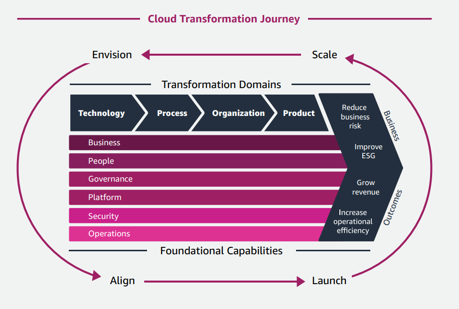

- The **AWS Cloud Adoption Framework (AWS CAF)** leverages AWS experience and best practices to help you digitally transform and accelerate your business outcomes through innovative use of AWS. 

-  AWS CAF groups its capabilities in six perspectives: **Business, People, Governance, Platform, Security, and Operations**. 

- **Business Perspective** helps ensure that your cloud investments accelerate your digital transformation ambitions and business outcomes.

- **People Perspective** serves as a bridge between technology and business, accelerating the cloud journey to help organizations more rapidly evolve to a culture of continuous growth, learning, and where change becomes business-as-normal, with focus on culture, organizational structure, leadership, and workforce.

- **Governance Perspective** helps you orchestrate your cloud initiatives while maximizing organizational benefits and minimizing transformation-related risks. 

- **Platform Perspective** helps you build an enterprise-grade, scalable, hybrid cloud platform; modernize existing workloads; and implement new cloudnative solutions. 

- **Security Perspective** helps you achieve the confidentiality, integrity, and availability of your data and cloud workloads. 

- **Operations Perspective** helps ensure that your cloud services are delivered at a level that meets the needs of your business.

- Each organization’s cloud journey is unique. The AWS CAF recommends four iterative and incremental cloud transformation phases: **Envision, Align, Launch, Scale**.

- **Envision Phase** focuses on demonstrating how the cloud will help accelerate your business outcomes. It does so by identifying and prioritizing transformation opportunities across each of the four transformation domains in line with your strategic business objectives. Associating your transformation initiatives with key stakeholders (senior individuals capable of influencing and driving change) and measurable business outcomes will help you demonstrate value as you progress through your transformation journey.
--------
- **Align Phase** focuses on identifying capability gaps across the six AWS CAF perspectives, identifying cross-organizational dependencies, and surfacing stakeholder concerns and challenges. Doing so will help you create strategies for improving your cloud readiness, ensure stakeholder alignment, and facilitate relevant organizational change management activities.
----------
- **Launch Phase** focuses on delivering pilot initiatives in production and on demonstrating incremental business value. Pilots should be highly impactful; if successful they will help influence future direction. Learning from pilots will help you adjust your approach before scaling to full production.
---------
- **Scale Phase** focuses on expanding production pilots and business value to desired scale and ensuring that the business benefits associated with your cloud investments are realized and sustained.

----------------------------------------------------------
