- **Six advantages of cloud computing**:
    - Pay-as-you-go
    - Benefit from massive economies of scale
    - Stop guesing capacity
    - Realize cost savings
    - Go global in minutes

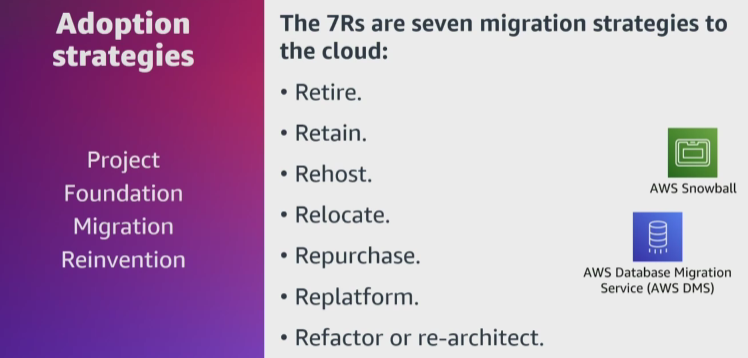

- The **project stage** is when you are evaluating if migrating to AWS would meet your specific requirements and needs. 

- The **foundation stage** is when the migration to AWS begins. Maybe you move a few production applications to AWS or deploy an initial framework for the landing zone to a non-production environment. 

- The **migration stage** is where you define roles for cloud operations, establish a cloud center of excellence, also known as a CCOE, and prepare for long-term cloud operations instead of on-premises operations. 

- Last is the **reinvention stage** where all new projects start in AWS. 

- **Retire** is for applications you want to decommission or retire. 
- **Retain** is for applications that you want to keep in the source environment or applications that are not ready to migrate. 
- **Rehost**, also known as lift and shift are for applications to migrate without making any changes to the application. 
- **Relocate** is for a large number of servers that are made up of one or more applications. 
- **Repurchase** is also known as drop and shop and is for applications with a different version or product and provides more value than the existing infrastructure. 
- **Replatform** is also known as lift, tinker, and shift and is for applications that need some level of optimization in order to operate efficiently or take advantage of AWS capabilities. 
- **Refactor or re-architect** is for applications that you want to migrate to AWS and take full advantage of the cloud-native features to improve agility, performance, and scalability.

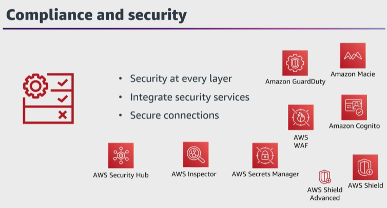

- **GuardDuty** is a threat detection service to monitor for malicious activity and unauthorized behavior.

- **AWS WAF** is a web application firewall to help protect your applications from common exploits that could impact your application availability, compromise your security or consume excessive resources.

- **AWS Shield** is a managed DDoS protections service to help safeguard your applications running on AWS. 

- **CloudTrail** is a service for governance, compliance, operational auditing, and risk auditing of your AWS account that continuously monitors and retains account activity related to actions across your AWS infrastructure. 

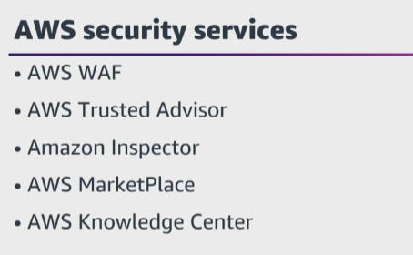

- **Network access control lists** see the traffic as two separate, different streams, so you must have two rules. One rule for each stream. If you do not add your outbound rule, then the traffic will only be allowed in. 
**Security groups** secure your resource level network such as your Amazon EC2 instances or Amazon RDS instances. They do not operate at the subnet level. They actually operate at the resources Elastic Network Interface level. Security groups also have inbound and outbound rules, but they are stateful, meaning that if the traffic is allowed in then that traffic is automatically allowed back out. 
Security groups see both the inbound and outbound traffic as part of the same stream. One big difference between security groups and network access control lists is that security groups recognize AWS resources. You can add rules for other security groups, or add a rule for the security group themselves. And another is that security groups have a hidden explicit deny, and that means that anything that's not explicitly allowed is denied. 

- There are also some AWS services, like **AWS Trusted Advisor or Amazon Inspector**, that can give you the recommendations around security.

- **AWS Marketplace** is a digital catalog where AWS users can discover, purchase, and deploy third-party software, data, and services that run on AWS. It simplifies software procurement by offering flexible pricing, quick deployment, and consolidated billing through AWS.

- The **AWS Knowledge Center** is one place to find answers to your questions, and the **Security Center** is another place for information related to security in AWS. 
You should also be comfortable reading **AWS security blogs**, and working with the **AWS Security Forum** to find information.

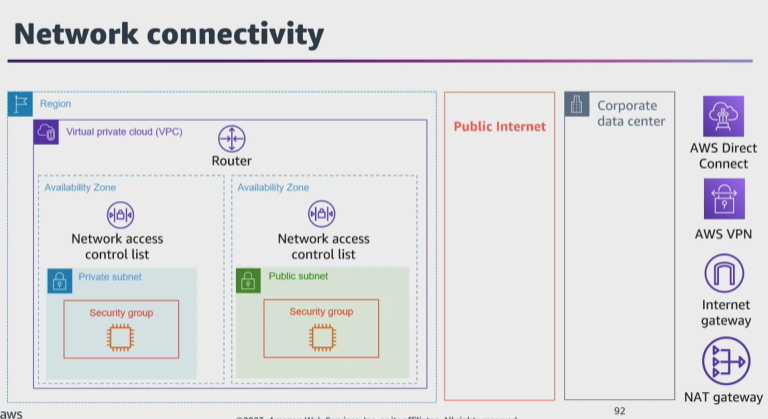

- **AWS Direct Connect** connections are a private dedicated connection, and dedicated connection is a keyword for Direct Connect.

- An **internet gateway** is a horizontally scaled, redundant, and highly available gateway to allow communication and traffic between instances in your VPC and the public internet. 

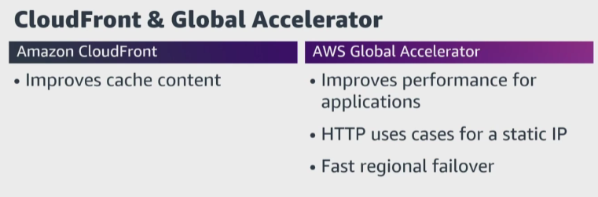

- AWS has a content delivery network or CDN, which is **CloudFront**. And CloudFront offers, that if a user requests certain information, that information is then cached at the edge location, so the next time another user requests that same information, that information is already available and delivered to the user much faster than if you had to go all the way back to the database and search for that specific information. 

- **AWS Global Accelerator**, which is a global service that supports endpoints in multiple AWS Regions to improve the performance of your applications for local and global users. 

- know the difference between **CloudFront and Global Accelerator**, because they both use the AWS Global Network and edge locations. Both also integrate with AWS Shield for DDoS protection. However, CloudFront will improve content for cache content, both static and dynamic content, and content is then served from that edge location most of the time. Global Accelerator improves the performance for applications over TCP and UDP because the packets are being proxied from the edge locations to the applications running in one or more Regions. So all the requests that are making it to the edge, but there is no caching available. Global Accelerator is great for HTTP use cases that need a static IP or need fast regional failover. 

- You pay for your individual instances and resources, but it is important to remember that when you use a shared host, your instance is isolated from other AWS customers. 
With **Dedicated Hosts**, you are paying for the entire EC2 host, not just the instances that you run on that host. You do not share it, you pay for the entire host, no matter how many instances you spin up.

- **Amazon EC2 instances** are group into five instance categories, and these categories help you select an instance type based on your particular workload. 

**General Purpose** is great for default steady state workloads, even resource rations, and should be used as default unless you have specific requirements. 
**Compute Optimized** instances are designed for high-performance computing such as media processing, machine learning, gaming, scientific modeling, and so on. The resource rations are usually more CPU than memory and they provide access to higher performance CPUs. 
**Memory Optimized** is great for processing large in memory datasets and database workloads. The resource rations are usually more memory than CPU. Accelerated Computing is designed for specific requirements such as hardware GPU and field programmable gate arrays. 
**Storage Optimized** is designed for applications using data warehousing, analytic workloads, Elasticsearch, sequel and random I/Os. And then there are EC2 instance types for each of these instance categories. 
We also have **burstable instances**. And what happens here is that instances have normal CPU loads that are low and you are given an allocation of burst credits that allows you to burst up and then return to the normal level. These are usually cheaper and a great option.

- A **golden AMI** is an AMI that contains the latest security patches, software, configuration, and software agents that you need to install for logging, security, maintenance, and performance monitoring.

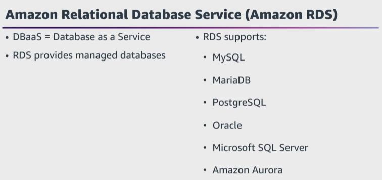

- if you see **asynchronous**, think read replicas, and **synchronous** replication would be the choice for any question with a multi-AZ environment or scenario.

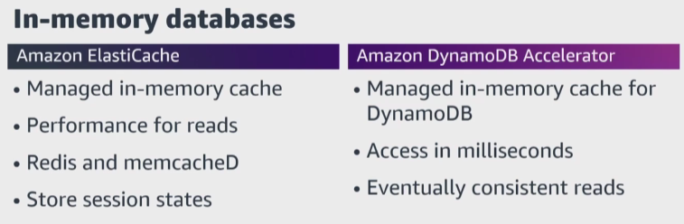

- **DAX** is designed for latency-sensitive and high-read workload. DAX is not great for applications that need strongly consistent reads. DAX is more for eventually consistent reads. 

- **AWS DataSync** makes it simple and fast to move large amounts of data online between on-premises storage and Amazon S3, Amazon EFS, or Amazon FSx for Windows File Server.

- **NAT** is the process of giving a private resource outgoing access to the internet.

- A **gateway endpoint** is used for AWS public services. 

- **Interface endpoints** are used for everything else, and you have to pick the correct endpoint depending on the AWS service. Interface endpoints use DNS, not routing with a prefix list, and are for all other services besides S3 and DynamoDB. 
**AWS PrivateLink**, which is a VPC endpoint service. PrivateLink solves the problems of needing to expose an application to other Amazon VPCs in other AWS accounts, and it does not require VPC peering or other gateways. 

- **Direct Connect** is a dedicated physical connection between your on-premises network and AWS. Direct Connect is a physical piece of fiber running between your on-premises network and AWS's network.

- **Linux** is a keyword for Amazon EFS. EFS is a shared file system for Linux and you cannot use Amazon EFS for Windows.

- AWS created **FSx for Windows** and it is a fully managed Windows file system share drive that supports the server message block protocol and Windows network technology file system. It supports active directory integration and access control list. It is built on a solid state drive, or SSD, and is a highly scalable distributed file system for Windows managed by AWS. It can scale up to 10 gigabytes per second and millions of IOPS. It is highly available and can be configured for multi-AZ and can be accessed from your on premises, and your data is backed up daily to S3. 

- **Amazon FSx for Lustre**, and Lustre is a type of parallel distributed file system for large scale computing. Lustre's name comes from Linux and cluster. It is for Linux instances and cluster is for large-scale computing. Lustre is great for machine learning and high-performance computing and has a sub-millisecond latency. Lustre is also great for file systems to perform video processing, financial modeling, design automation, whatever needs a high level of distribution.

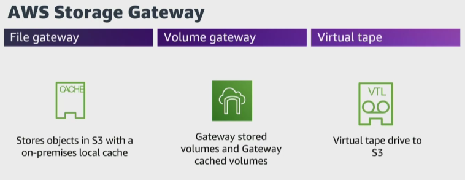

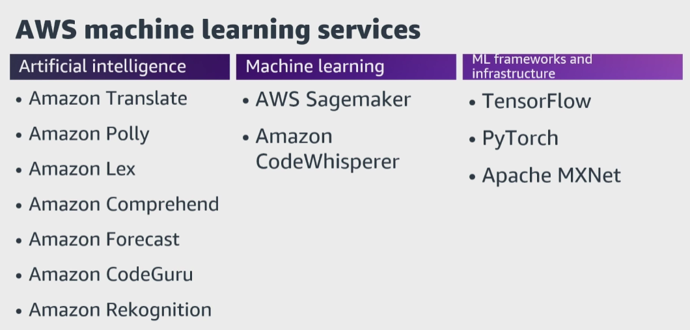

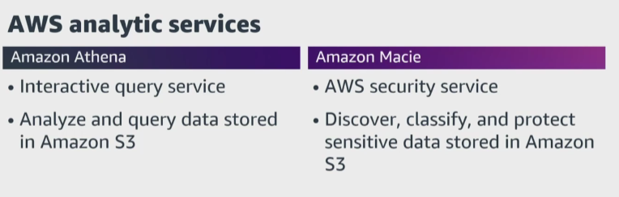

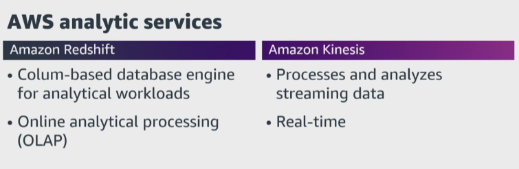

- **Redshift spectrum** go along with S3. 

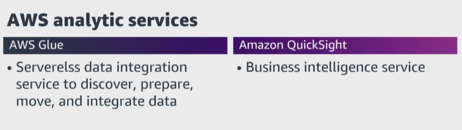

- **AWS Glue** is a serverless data integration service that makes it easy for analytics users to discover, prepare, move, and integrate data from multiple sources. You can use it for analytics, machine learning, and application development. It also includes additional productivity and data operations tooling for authoring, running jobs, and implementing business workflows. You can visually create, run, and monitor extract, transform, and load pipelines to load data into your data lakes. Also, you can immediately search and query cataloged data using Amazon Athena, or Amazon Elastic Map Reduce, and also Amazon Redshift Spectrum.

- **Amazon QuickSight** which is a fast, business intelligence service that delivers insights to everyone in your organization. As a fully managed service, Amazon QuickSight lets you create and publish interactive dashboards that include machine learning insights.

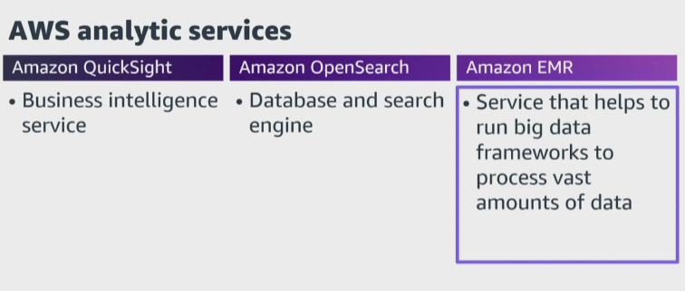

- **EMR** is a web service that enables businesses, researchers, data analysts, and developers to process vast amounts of data. It utilizes a hosted Apache Hadoop framework running on the infrastructure of Amazon EC2 and Amazon S3. EMR can securely and reliably handle broad sets of big data use cases, including machine learning, data transformations, financial and scientific simulation, bioinformatics, log analysis, and deep learning too.

- And **SQS** has two types of polling, short polling and long polling. **Short polling** is a single API call to check the queue for any messages, and you will get the messages available in the queue up to a maximum of 10 messages or you'll get no messages. With short polling, it responds immediately to any messages in the queue, meaning you will need to constantly be sending API calls to check the queue for messages, and this consumes a lot of API calls. 
But you can also use **long polling**, and this is the same process to check for messages in the queue as short polling; however, you wait for a certain amount of time, and that time is known as the WaitTimeSeconds. And long polling is more efficient because you have a lot less API calls to the queue, but also a lot less of empty API calls. 

SQS queues come in two different types too; **standard and first in or first out**, also known as FIFO queues. Standard was the AWS original, and FIFO queues were added later.

**if you see decouple, asynchronous messaging, or the ability to have independent scaling of your application on your exam, the correct answer might be SQS.**

- **SNS** is a highly available, durable and secure pub sub messaging. It is a **public AWS service**, so you need network connectivity, and it is accessible wherever network connectivity is available. SNS coordinates the sending and delivery of messages, and SNS is used by many AWS services, such as CloudWatch when alarms change states, auto scaling groups can be configured to send notifications to a topic when a scaling event occurs, and also with CloudFormation when stacks change state and so on.

- **Amazon Connect** is a contact center that helps to provide customer service for voice and chat across customers and agents. **Amazon Simple Email Service (SES)** is a cost-effective, flexible, and scalable email service to send mail from within any application. And with Amazon SES you can send emails securely, globally, and at scale. 

Amazon SES is a great choice if you need the email to come from a custom domain.

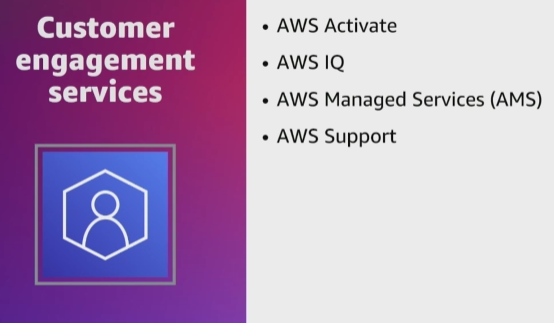

- **AWS Activate** provides eligible startups with free tools, resources, and content, designed to simplify every step of the startup journey. 

- **AWS IQ** connects you to an AWS certified expert for hands-on help for your AWS projects. 

- **AWS Managed Services** is infrastructure operations management for AWS, and it is an enterprise service that provides ongoing management of your AWS infrastructure. 

- **AWS Support** offers a range of plans that provide access to tools and expertise that support the success and operational health of your AWS solutions. AWS support plans provide 24/7 access to customer service, AWS documentation, technical papers, and support forums. For technical support and more resources to plan, deploy, and improve your AWS environment, you can choose a support plan for your AWS use cases.

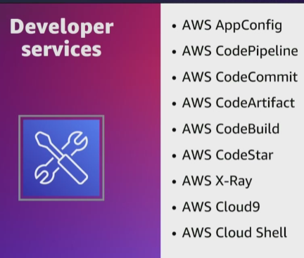

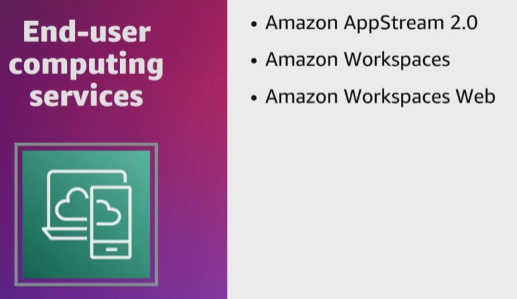

- **Amazon AppStream 2.0** is a fully managed application streaming service that provides users with instant access to their desktop applications from anywhere. 

- **Amazon WorkSpaces** helps to provision virtual cloud-based Microsoft Windows, Amazon Linux, or Ubuntu Linux desktops for your users known as WorkSpaces. 

- **Amazon WorkSpaces Web** is an on-demand, fully managed, Linux-based service designed to facilitate secure browser access to internal websites and software-as-a-service applications.

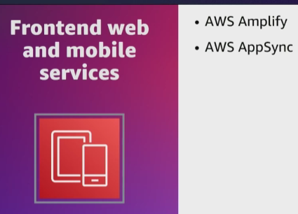

- **AWS Amplify** is a complete solution that lets front-end web and mobile developers easily build, ship, and host, full-stack applications on AWS. 

- **AWS AppSync** provides a robust, scalable GraphQL interface for application developers to combine data from multiple sources, including Amazon DynamoDB, AWS Lambda, and HTTP APIs. 

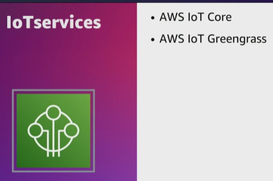

- **AWS IoT** provides device software that can help you integrate your IoT devices into AWS IoT-based solutions. 

- **AWS IoT Greengrass** is a software that extends cloud capabilities to local devices to collect and analyze data closer to the source of the information, react autonomously to local events, and communicate securely with each other on local networks. 

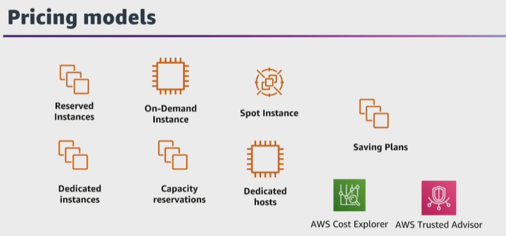

- **On-Demand Instances**

    Pay for compute capacity by the hour or second with no long-term commitment.
    Ideal for short-term, irregular, or unpredictable workloads.
    Best for applications that cannot tolerate interruptions.

- **Reserved Instances** (RI)

    Require a 1- or 3-year commitment, but offer up to 72% savings compared to On-Demand pricing.
    Best for steady-state, long-term workloads.
    Can be All Upfront, Partial Upfront, or No Upfront payment options.
    You pay for the reservation whether instances are running or not.
    Regional Reserved Instances apply discounts across any Availability Zone in the Region.
    Convertible Reserved Instances allow changes to instance family, OS, or tenancy.
    Scheduled Reserved Instances match predictable, recurring schedules.
    Standard Reserved Instances provide the highest discount.
    With Consolidated Billing, all accounts in an AWS Organization share RI discounts.

- **Spot Instances**

    Use AWS spare EC2 capacity at up to 90% off On-Demand pricing.
    Prices vary based on available capacity.
    Best for flexible applications that can withstand interruptions or failures.

- **Dedicated Hosts / Dedicated Instances**

    Dedicated Hosts – physical servers dedicated to a single customer; you pay for the host itself.
    Dedicated Instances – run on single-tenant hardware; you pay per instance-hour.

- **Saving Plans**

    Flexible pricing model for compute usage (EC2, Lambda, ECS).
    Help you save on consistent compute workloads.

- **Cost Optimization Tools**

    AWS Trusted Advisor – provides recommendations for cost optimization and performance.
    AWS Cost Explorer – allows monitoring and analyzing your spending.

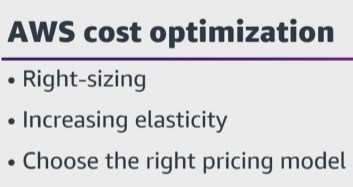

- **Rightsizing** is picking the correct instances for your current resources, but also for resources you plan to use. So maybe you are using a larger EC2 instance size when all you need to cover your demand is a small instance size. Rightsizing and choosing the correct instance type but also the cheapest instance type that meets performance requirements can save you money. 

- You must also ensure you are **increasing elasticity** and only using resources when those resources are needed, which gives you a pay-for-what-you-use model. Again, using smaller instances versus fewer larger instances for your workload can reduce your costs, but also using auto scaling to scale up your instances when the demand scales and then scale back down when the demand lessens reduces cost even further. 

- Another cost optimization necessity is **choosing the right pricing model**, which is the focus for this task statement, and choosing the right pricing model comes into play after you have right-sized your instances and set up auto scaling. 

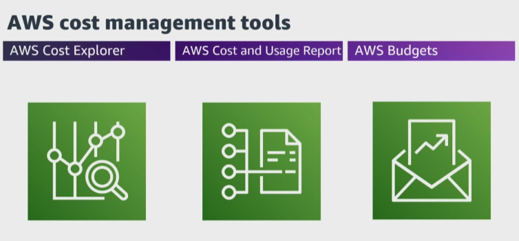

- **Cost Explorer** gives you a high-level view that you can then drill down into more specifics. **AWS Cost and Usage Reports** breakdown costs by the hour, day, month, product, resource tags, and so on to provide the most granular data about your AWS cost and usage, and you can send that data to Amazon Athena, Amazon Redshift, AWS QuickSight, or another tool to perform quick queries and more. 
You can also create billing alarms, free tier alarms, and alarms with **AWS Budgets**. 

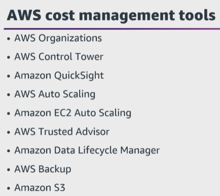

- **AWS Organizations and Control Tower** help to centrally manage billing, control access, compliance, security, and share resources too.

- You can also use data visualization tools like **Amazon QuickSight** to analyze AWS Cost and Usage Reports, or to create custom reports.

- **Trusted Advisor** can give recommendations when it finds underutilized EBS volumes in your account.

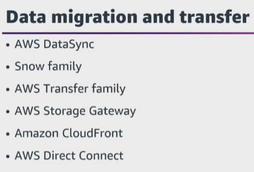

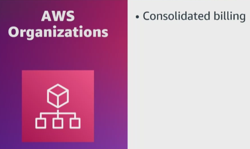

- **consolidated billing** enables you to share resources, see a combined view of AWS costs incurred by all accounts in your department or company, as well as obtain a detailed cost report for each individual AWS account associated with your paying account. For billing purposes, AWS treats all the accounts in the AWS Organization as if they were one account. With consolidated billing, AWS combines the usage from all accounts to determine which volume pricing tier to apply, giving you a lower overall price whenever possible and then allocates each linked account a portion of the overall volume discount based on the account's usage.

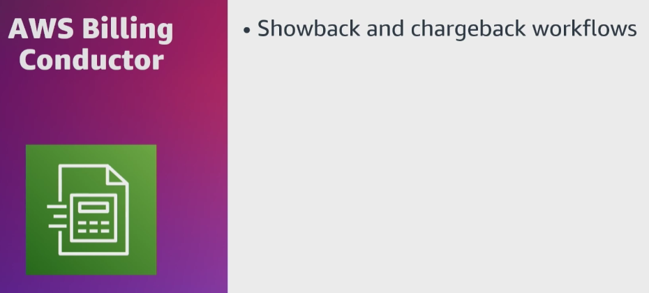

- The **AWS Billing Conductor**, which is a custom billing service that can support the showback and chargeback workflows of AWS Solution Providers and Enterprise customers. 

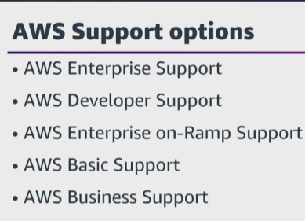

- **AWS Enterprise support** provides you with a concierge service where the main focus is to help you be successful in AWS. You get 24/7 technical support from engineers, tools, technology to automatically manage the health of your environment, a designated technical account manager to coordinate access to proactive and preventative programs, and AWS subject matter experts.

- The most cost-effective support plan that offers a technical support with an unlimited number of cases that can be opened is the **Developer support plan**.

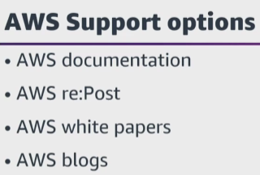

- Where do you go if you need guided instructions on how to deploy a service for the first time? My first choice is **AWS documentation**. 
What do you look for for AWS best practices? My first choice is the **AWS Well-Architected Framework**, and then the AWS documentation for the service that I'm interested in. 
How do you seek community support when you have a very specific question about what you're building? **AWS re:Post**. 

- **The AWS Partner Network (APN)** is focused on helping partners build successful AWS-based businesses to drive superb customer experiences. This is accomplished by developing a global ecosystem of Partners with specialties unique to each customer’s needs.

There are two types of APN Partners:

    1. APN Consulting Partners
    2. APN Technology Partners

- **APN Consulting Partners** are professional services firms that help customers of all sizes design, architect, migrate, or build new applications on AWS. Consulting Partners include System Integrators (SIs), Strategic Consultancies, Resellers, Digital Agencies, Managed Service Providers (MSPs), and Value-Added Resellers (VARs).

- **APN Technology Partners** provide software solutions that are either hosted on or integrated with the AWS platform. Technology Partners include Independent Software Vendors (ISVs), SaaS, PaaS, developer tools, management, and security vendors.

- 