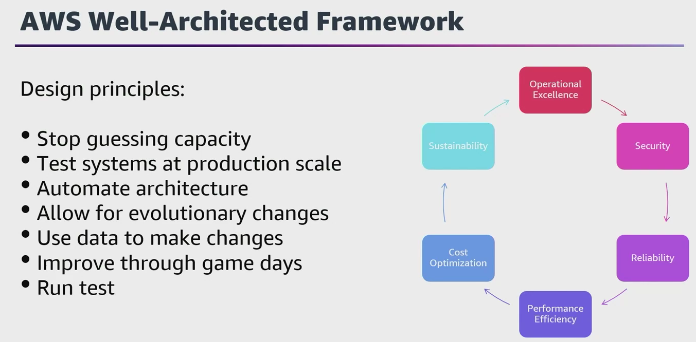
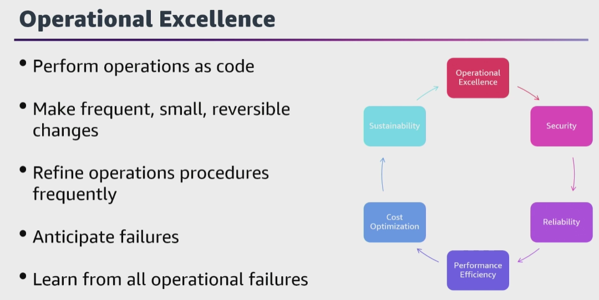
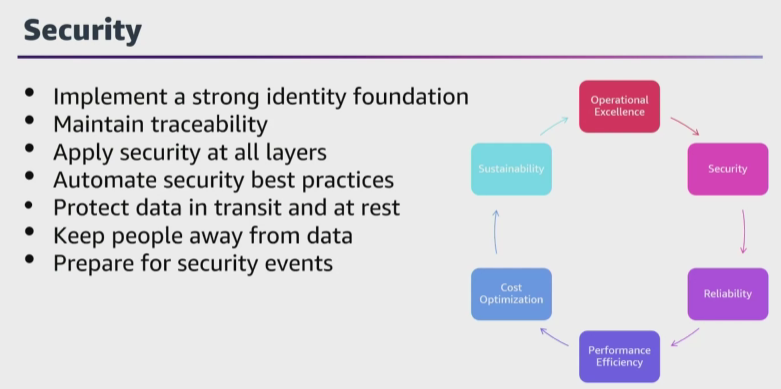
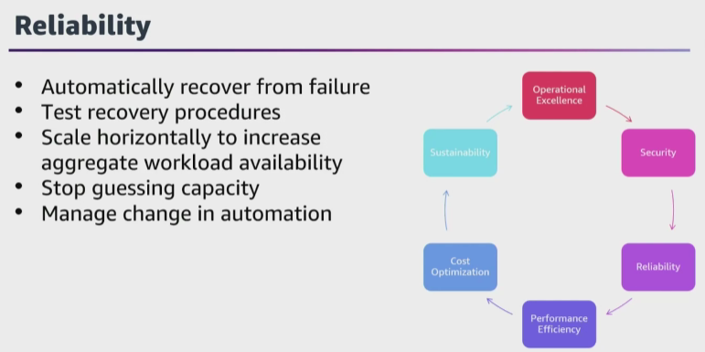
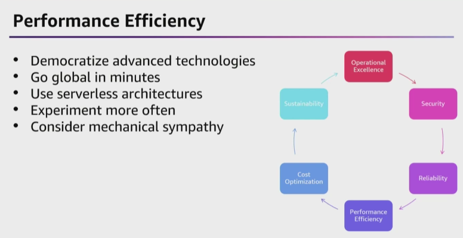
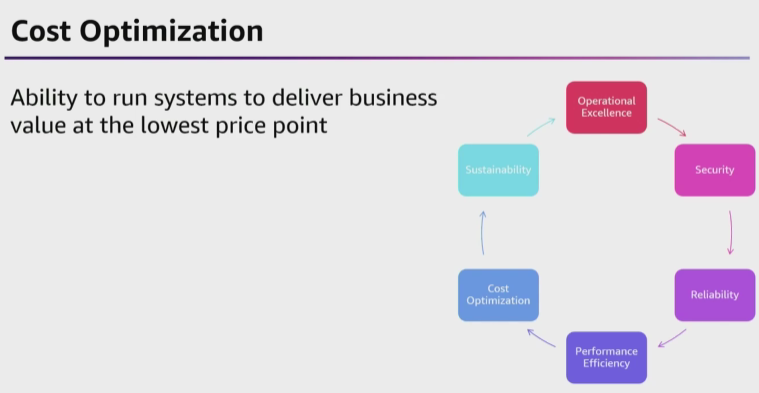
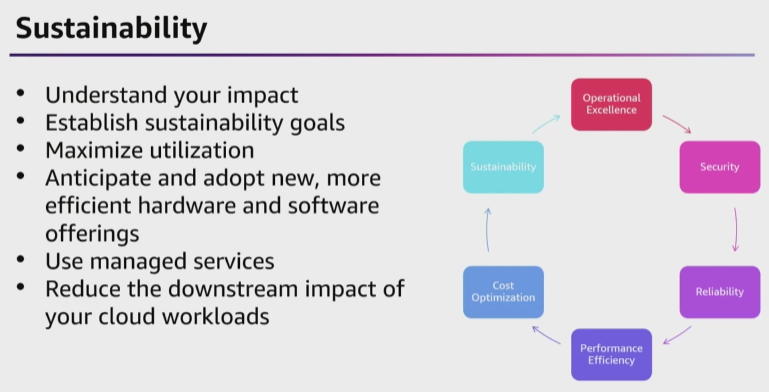

- The first pillar is **operational excellence** which is the ability to support development and run workloads effectively, gain insight into their operations, and to continuously improve supporting processes and procedures to deliver business value. 

- The second pillar encompasses the ability to protect data, systems and assets to take advantage of cloud technologies to improve your **security**.

-  The **reliability** pillar encompasses the ability of a workload to perform its intended function correctly and consistently when it's expected to. This includes the ability to operate and test the workload through its total lifecycle.

- The **performance efficiency** pillar includes the ability to use computing resources efficiently to meet system requirements and to maintain that efficiency as demand changes and technologies evolve. 

- The **cost optimization** pillar includes the ability to run systems to deliver business value at the lowest price point.

- sixth pillar is the **sustainability** pillar. This pillar focuses on environmental impacts, especially energy consumption and efficiency, because they are important levers for architects to inform direct action to reduce resource usage.

