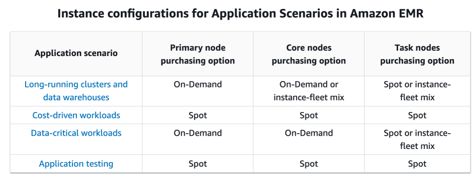

- The **Instance Scheduler** on AWS solution automates the starting and stopping of Amazon Elastic Compute Cloud (Amazon EC2) and Amazon Relational Database Service (Amazon RDS) instances.

 Instance Scheduler is not an AWS service or feature, but a CloudFormation template provided by AWS. By deploying this template, you can simply set the desired start and stop schedules for your EC2 and RDS instances to match your application’s operating hours.

 - **Amazon Aurora** is a relational database service that combines the speed and availability of high-end commercial databases with the simplicity and cost-effectiveness of open-source databases. Aurora is fully compatible with MySQL and PostgreSQL, allowing existing applications and tools to run without requiring modification.

 Amazon Aurora Serverless v2 suits the most demanding, highly variable workloads. In contrast, Aurora provisioned clusters are suitable for steady workloads. With provisioned clusters, you choose a DB instance class with a predefined amount of memory, CPU power, I/O bandwidth, etc. Aurora Serverless v2 is architected from the ground up to support serverless DB clusters that are instantly scalable.

 The unit of measure for Aurora Serverless v2 is the **Aurora capacity unit (ACU)**. Each ACU includes about 2 gibibytes (GiB) of memory, along with the necessary CPU and networking.

 Amazon Aurora Serverless is an on-demand, auto-scaling configuration for Amazon Aurora. An Aurora Serverless DB cluster is a DB cluster that automatically starts up, shuts down, and scales up or down its compute capacity based on your application's needs. Aurora Serverless provides a relatively simple, cost-effective option for infrequent, intermittent, sporadic, or unpredictable workloads. It can provide this because it automatically starts up, scales compute capacity to match your application's usage, and shuts down when it's not in use.

 Take note that a non-Serverless DB cluster for Aurora is called a provisioned DB cluster. Aurora Serverless clusters and provisioned clusters both have the same kind of high-capacity, distributed, and highly available storage volume.

 When you work with Amazon Aurora without Aurora Serverless (provisioned DB clusters), you can choose your DB instance class size and create Aurora Replicas to increase read-throughput. If your workload changes, you can modify the DB instance class size and change the number of Aurora Replicas. This model works well when the database workload is predictable because you can adjust capacity manually based on the expected workload.

 However, in some environments, workloads can be intermittent and unpredictable. There can be periods of heavy workloads that might last only a few minutes or hours, and also long periods of light activity or even no activity. Some examples are retail websites with intermittent sales events, reporting databases that produce reports when needed, development and testing environments, and new applications with uncertain requirements. In these cases and many others, it can be difficult to configure the correct capacity at the right times. It can also result in higher costs when you pay for capacity that isn't used.

 With Aurora Serverless, you can create a database endpoint without specifying the DB instance class size. You set the minimum and maximum capacity. With Aurora Serverless, the database endpoint connects to a proxy fleet that routes the workload to a fleet of resources that are automatically scaled. Because of the proxy fleet, connections are continuous as Aurora Serverless scales the resources automatically based on the minimum and maximum capacity specifications. Database client applications don't need to change to use the proxy fleet. Aurora Serverless manages the connections automatically. Scaling is rapid because it uses a pool of "warm" resources that are always ready to service requests. Storage and processing are separate, so you can scale down to zero processing and pay only for storage.

 Aurora Serverless introduces a new serverless DB engine mode for Aurora DB clusters. Non-Serverless DB clusters use the provisioned DB engine mode.
 - **IAM database authentication** works with MySQL and PostgreSQL. With this authentication method, you don’t need to use a password when you connect to a DB instance. Instead, you use an authentication token.

 - **Tape Gateway** enables you to replace physical tapes on-premises with virtual tapes in AWS without changing existing backup workflows. 
 Tape Gateway supports all leading backup applications and caches virtual tapes on-premises for low-latency data access. Tape Gateway encrypts data between the gateway and AWS for secure data transfer and compresses data and transitions virtual tapes between Amazon S3 and Amazon S3 Glacier Flexible Retrieval, or Amazon S3 Glacier Deep Archive, to minimize storage costs.
 
 The **FTP protocol** uses TCP via ports 20 and 21.
 In the provided IP address, the /0 refers to the entire network and not a specific IP address.

 - **AWS Storage Gateway** connects an on-premises software appliance with cloud-based storage to provide seamless integration with data security features between your on-premises IT environment and the AWS storage infrastructure

- **Amazon Comprehend Medical** is a natural language processing service that makes it easy to use machine learning to extract relevant medical information from unstructured text

Amazon Transcribe is an AWS service that makes it easy for customers to convert speech-to-text. Using Automatic Speech Recognition (ASR) technology, customers can choose to use Amazon Transcribe for a variety of business applications, including transcription of voice-based customer service calls, generation of subtitles on audio/video content, and conduct (text-based) content analysis on audio/video content.

Amazon Translate is a Neural Machine Translation (MT) service for translating text between supported languages.

Amazon Comprehend is a natural language processing (NLP) service that uses machine learning to find meaning and insights in text.

Amazon Kendra is a highly accurate and easy-to-use enterprise search service for all unstructured data that you store in AWS, while Amazon Detective is a security service that analyzes and visualizes security data to rapidly get to the root cause of your potential security issues.

- A **security group** acts as a virtual firewall for your instance to control inbound and outbound traffic.
When you launch an instance in a VPC, you can assign up to five security groups to the instance. Security groups act at the instance level, not the subnet level.

the Network ACL covers the entire subnet which means that other applications that use the same subnet will also be affected.

- Redshift is primarily used for OLAP (Online Analytical Processing) applications

- **Flow Logs** are used in VPC

- S3 is not a suitable service to store the SSL certificate

- **Amazon EMR** (Amazon Elastic MapReduce) is a managed cluster platform that simplifies running big data frameworks, such as Apache Hadoop and Apache Spark, on AWS to process and analyze vast amounts of data. By using these frameworks and related open-source projects such as Apache Hive and Apache Pig, you can process data for analytics purposes and business intelligence workloads. Additionally, you can use Amazon EMR to transform and move large amounts of data into and out of other AWS data stores and databases such as Amazon Simple Storage Service (Amazon S3) and Amazon DynamoDB.

In Amazon EMR (Elastic MapReduce), a cluster comprises three main types of nodes, each serving a specific function:

Primary (Master) Node: Manages the distribution of data and tasks among other nodes, monitors the health of the cluster, and communicates with external clients. It’s responsible for orchestrating the processing of data across the cluster.
Core Nodes: These nodes store data and execute tasks. They are crucial for both data storage in HDFS (Hadoop Distributed File System) and for processing tasks. There is only one core instance group or instance fleet per cluster, but there can be multiple nodes running on multiple Amazon EC2 instances in the instance group or instance fleet. With instance groups, you can add and remove Amazon EC2 instances while the cluster is running. You can also set up automatic scaling to add instances based on the value of a metric.
Task Nodes: Task nodes are optional and dedicated solely to processing tasks. They do not store data. Task nodes can be added or removed from the cluster to increase the processing power as needed, making them a flexible resource for managing workload demands.
In Amazon EMR clusters, selecting the right instance type—Spot, On-Demand, or Instance Fleets—boils down to a trade-off between cost savings and the importance of uninterrupted operations. For primary and core nodes, where consistent availability is crucial to prevent data loss and ensure smooth processing, use On-Demand Instances. However, for task nodes, which handle additional processing without storing data, Spot Instances offer a cheaper option, albeit with the risk of interruptions. Instance Fleets provide flexibility, allowing you to mix instance types to optimize both performance and cost, tailoring your EMR cluster to meet specific operational needs efficiently.

In Amazon EMR (Elastic MapReduce), a cluster comprises three main types of nodes, each serving a specific function:

**Primary (Master) Node**: Manages the distribution of data and tasks among other nodes, monitors the health of the cluster, and communicates with external clients. It's responsible for orchestrating the processing of data across the cluster.

**Core Nodes**: These nodes store data and execute tasks. They are crucial for both data storage in HDFS (Hadoop Distributed File System) and for processing tasks. There is only one core instance group or instance fleet per cluster, but there can be multiple nodes running on multiple Amazon EC2 instances in the instance group or instance fleet. With instance groups, you can add and remove Amazon EC2 instances while the cluster is running. You can also set up automatic scaling to add instances based on the value of a metric.

**Task Nodes**: Task nodes are optional and dedicated solely to processing tasks. They do not store data. Task nodes can be added or removed from the cluster to increase the processing power as needed, making them a flexible resource for managing workload demands.

In Amazon EMR clusters, selecting the right instance type—Spot, On-Demand, or Instance Fleets—boils down to a trade-off between cost savings and the importance of uninterrupted operations. For primary and core nodes, where consistent availability is crucial to prevent data loss and ensure smooth processing, use On-Demand Instances. However, for task nodes, which handle additional processing without storing data, Spot Instances offer a cheaper option, albeit with the risk of interruptions. Instance Fleets provide flexibility, allowing you to mix instance types to optimize both performance and cost, tailoring your EMR cluster to meet specific operational needs efficiently.

- If your identity store is not compatible with SAML 2.0 then you can build a custom identity broker application to perform a similar function. The broker application authenticates users, requests temporary credentials for users from AWS, and then provides them to the user to access AWS resources.

The application verifies that employees are signed into the existing corporate network’s identity and authentication system, which might use LDAP, Active Directory, or another system. The identity broker application then obtains temporary security credentials for the employees.

To get temporary security credentials, the identity broker application calls either AssumeRole or GetFederationToken to obtain temporary security credentials, depending on how you want to manage the policies for users and when the temporary credentials should expire. The call returns temporary security credentials consisting of an AWS access key ID, a secret access key, and a session token. The identity broker application makes these temporary security credentials available to the internal company application. The app can then use the temporary credentials to make calls to AWS directly. The app caches the credentials until they expire, and then requests a new set of temporary credentials.

- **Amazon CloudWatch** agent enables you to collect both system metrics and log files from Amazon EC2 instances and on-premises servers. The agent supports both Windows Server and Linux and allows you to select the metrics to be collected, including sub-resource metrics such as per-CPU core.

- By default, CloudTrail event log files are encrypted using Amazon S3 server-side encryption (SSE).

You can also choose to encrypt your log files with an AWS Key Management Service (AWS KMS) key. You can store your log files in your bucket for as long as you want. You can also define Amazon S3 lifecycle rules to archive or delete log files automatically. If you want notifications about log file delivery and validation, you can set up Amazon SNS notifications.

- A DynamoDB stream is an ordered flow of information about changes to items in an Amazon DynamoDB table. When you enable a stream on a table, DynamoDB captures information about every modification to data items in the table.

- Whenever an application creates, updates, or deletes items in the table, DynamoDB Streams writes a stream record with the primary key attribute(s) of the items that were modified. A stream record contains information about a data modification to a single item in a DynamoDB table. You can configure the stream so that the stream records capture additional information, such as the “before” and “after” images of modified items.

DynamoDB Stream feature is not enabled by default

Amazon DynamoDB is integrated with AWS Lambda so that you can create triggers—pieces of code that automatically respond to events in DynamoDB Streams. With triggers, you can build applications that react to data modifications in DynamoDB tables.

DynamoDB Streams captures a time-ordered sequence of item-level modifications in any DynamoDB table and stores this information in a log for up to 24 hours. Applications can access this log and view the data items as they appeared before and after they were modified, in near-real-time.

You can consume logs stored in DynamoDB streams in multiple ways. The most common approaches use AWS Lambda or a standalone application that uses the Kinesis Client Library (KCL) with the DynamoDB Streams Kinesis Adapter. In the scenario, we use a Lambda function where the fraud detection model is deployed. By setting the Lambda function as the trigger, you can configure DynamoDB streams to let AWS Lambda run your code when an item is inserted into the table. In this approach, Lambda reads the DynamoDB stream, checks if a transaction is fraudulent, then publishes a message to the SNS topic.

- **AWS Lambda** supports both synchronous and asynchronous invocation of functions.

- **Step Functions** is an orchestration service (branching, sequencing, human approval, retries) and adds per–state transition cost without a workflow need here.

- **Amazon CloudFront** is a content delivery network (CDN) service that enables the efficient distribution of web content to users across the globe. It reduces latency by caching static and dynamic content in multiple edge locations worldwide and improves the overall user experience.

- **Lambda@Edge** allows you to run Lambda functions at the edge locations of the CloudFront CDN. With this, you can perform various tasks, such as modifying HTTP headers, generating dynamic responses, implementing security measures, and customizing content based on user preferences, device type, location, or other criteria.

Lambda@Edge is a feature of Amazon CloudFront that lets you run code closer to users of your application, which improves performance and reduces latency. With Lambda@Edge, you don’t have to provision or manage infrastructure in multiple locations around the world. You pay only for the compute time you consume – there is no charge when your code is not running.

Lambda@Edge lets you run Lambda functions to customize the content that CloudFront delivers, executing the functions in AWS locations closer to the viewer. The functions run in response to CloudFront events, without provisioning or managing servers. You can use Lambda functions to change CloudFront requests and responses at the following points:

    – After CloudFront receives a request from a viewer (viewer request)

    – Before CloudFront forwards the request to the origin (origin request)

    – After CloudFront receives the response from the origin (origin response)

    – Before CloudFront forwards the response to the viewer (viewer response)

-  An **Elastic Fabric Adapter (EFA)** is simply a network device that you can attach to your Amazon EC2 instance that enables you to achieve the application performance of an on-premises High Performance Computing (HPC) cluster, with scalability, flexibility, and elasticity provided by the AWS Cloud.

EFA provides lower and more consistent latency and higher throughput than the TCP transport traditionally used in cloud-based HPC systems. It enhances the performance of inter-instance communication which is critical for scaling HPC and machine learning applications. It is optimized to work on the existing AWS network infrastructure, and it can scale depending on application requirements.

EFA integrates with Libfabric 1.9.0, and it supports Open MPI 4.0.2 and Intel MPI 2019 Update 6 for HPC applications and Nvidia Collective Communications Library (NCCL) for machine learning applications.

EFA enables you to achieve the application performance of an on-premises HPC cluster, with the scalability, flexibility, and elasticity provided by AWS.

- **Internet gateway** is used for instances in the public subnet to have accessibility to the Internet.

- A **transit gateway** is a network transit hub that you can use to interconnect your virtual private clouds (VPCs) and on-premises networks. As your cloud infrastructure expands globally, inter-Region peering connects transit gateways together using the AWS Global Infrastructure. Your data is automatically encrypted and never travels over the public internet.
A transit gateway attachment is both a source and a destination of packets. You can attach the following resources to your transit gateway:

    – One or more VPCs.

    – One or more VPN connections

    – One or more AWS Direct Connect gateways

    – One or more Transit Gateway Connect attachments

    – One or more transit gateway peering connections

AWS Transit Gateway deploys an elastic network interface within VPC subnets, which is then used by the transit gateway to route traffic to and from the chosen subnets. You must have at least one subnet for each Availability Zone, which then enables traffic to reach resources in every subnet of that zone. During attachment creation, resources within a particular Availability Zone can reach a transit gateway only if a subnet is enabled within the same zone. If a subnet route table includes a route to the transit gateway, traffic is only forwarded to the transit gateway if the transit gateway has an attachment in the subnet of the same Availability Zone.

- **NAT Gateway** allows instances in the private subnet to gain access to the Internet, but not vice versa.

- **Amazon S3 File Gateway** presents a file interface that enables you to store files as objects in Amazon S3 using the industry-standard NFS and SMB file protocols, and access those files via NFS and SMB from your data center or Amazon EC2, or access those files as objects directly in Amazon S3.

- A **file gateway** supports a file interface into Amazon Simple Storage Service (Amazon S3) and combines a service and a virtual software appliance. By using this combination, you can store and retrieve objects in Amazon S3 using industry-standard file protocols such as Network File System (NFS) and Server Message Block (SMB). The software appliance, or gateway, is deployed into your on-premises environment as a virtual machine (VM) running on VMware ESXi, Microsoft Hyper-V, or Linux Kernel-based Virtual Machine (KVM) hypervisor.

The gateway provides access to objects in S3 as files or file share mount points. With a file gateway, you can do the following:

    – You can store and retrieve files directly using the NFS version 3 or 4.1 protocol.

    – You can store and retrieve files directly using the SMB file system version, 2 and 3 protocol.

    – You can access your data directly in Amazon S3 from any AWS Cloud application or service.

    – You can manage your Amazon S3 data using lifecycle policies, cross-region replication, and versioning. You can think of a file gateway as a file system mount on S3.

- For sub-millisecond latency caching, **ElastiCache** is the best choice. In order to address scalability and to provide a shared data storage for sessions that can be accessed from any individual web server, you can abstract the HTTP sessions from the web servers themselves. A common solution for this is to leverage an In-Memory Key/Value store such as Redis and Memcached.

- port 22 is used for SSH; When connecting to your EC2 instance via SSH, you need to ensure that port 22 is allowed on the security group of your EC2 instance.

- Remote Desktop Protocol is allowed in the security group. By default, the server listens on TCP port 3389 and UDP port 3389.

- IAM database authentication is only supported in MySQL and PostgreSQL database engines. With IAM database authentication, you don’t need to use a password when you connect to a DB instance but instead, you use an authentication token.

- **AWS Global Accelerator** is a service that improves the availability and performance of your applications with local or global users. It provides static IP addresses that act as a fixed entry point to your application endpoints in a single or multiple AWS Regions, such as your Application Load Balancers, Network Load Balancers, or Amazon EC2 instances.

When the application usage grows, the number of IP addresses and endpoints that you need to manage also increase. AWS Global Accelerator allows you to scale your network up or down. AWS Global Accelerator lets you associate regional resources, such as load balancers and EC2 instances, to two static IP addresses. You only whitelist these addresses once in your client applications, firewalls, and DNS records.

AWS Global Accelerator and Amazon CloudFront are separate services that use the AWS global network and its edge locations around the world. CloudFront improves performance for both cacheable content (such as images and videos) and dynamic content (such as API acceleration and dynamic site delivery). Global Accelerator improves performance for a wide range of applications over TCP or UDP by proxying packets at the edge to applications running in one or more AWS Regions. Global Accelerator is a good fit for non-HTTP use cases, such as gaming (UDP), IoT (MQTT), or Voice over IP, as well as for HTTP use cases that specifically require static IP addresses or deterministic, fast regional failover. Both services integrate with AWS Shield for DDoS protection.

- **On-Demand Capacity Reservations** enable you to reserve compute capacity for your Amazon EC2 instances in a specific Availability Zone for any duration. This gives you the ability to create and manage Capacity Reservations independently from the billing discounts offered by Savings Plans or Regional Reserved Instances.

By creating Capacity Reservations, you ensure that you always have access to EC2 capacity when you need it, for as long as you need it. You can create Capacity Reservations at any time, without entering into a one-year or three-year term commitment, and the capacity is available immediately. Billing starts as soon as the capacity is provisioned and the Capacity Reservation enters the active state. When you no longer need it, cancel the Capacity Reservation to stop incurring charges.

When you create a Capacity Reservation, you specify:

    – The Availability Zone in which to reserve the capacity

    – The number of instances for which to reserve capacity

    – The instance attributes, including the instance type, tenancy, and platform/OS

Capacity Reservations can only be used by instances that match their attributes. By default, they are automatically used by running instances that match the attributes. If you don’t have any running instances that match the attributes of the Capacity Reservation, it remains unused until you launch an instance with matching attributes.

In addition, you can use Savings Plans and Regional Reserved Instances with your Capacity Reservations to benefit from billing discounts. AWS automatically applies your discount when the attributes of a Capacity Reservation match the attributes of a Savings Plan or Regional Reserved Instance.

- **AWS Elastic Disaster Recovery (AWS DRS)** provides continuous block-level replication, recovery orchestration, and automated server conversion capabilities. These allow customers to achieve a crash-consistent recovery point objective (RPO) of seconds, and a recovery time objective (RTO) typically ranging between 5–20 minutes.

In the event of a disaster, AWS Elastic Disaster Recovery (AWS DRS) assists in performing a failover to AWS for immediate recovery. After mitigating the disaster, a failback to the original source infrastructure is necessary. AWS DRS facilitates preparedness through easy drill launches and frequent testing of instances. During a failover, recovery instances are launched in AWS based on a selected snapshot. To complete the failback, the AWS Elastic Disaster Recovery Failback Client is installed on the target server, and specific credentials are generated. Cross-Region or cross-AZ failover and failback can be executed directly from the AWS DRS Console. For vCenter, AWS DRS offers scalable failback with the DRS Mass Failback Automation client (DRSFA client). Once the failback is finished, the recovery instance can be terminated, deleted, or disconnected.

To establish a secure data replication process, configure AWS Elastic Disaster Recovery on your source servers. This setup involves replicating your data to a dedicated subnet within your AWS account located in the AWS Region of your choice. By utilizing a staging area design, this approach optimizes cost-efficiency by leveraging cost-effective storage and minimal compute resources for continuous replication maintenance.

- **AWS Elastic Beanstalk** supports the deployment of web applications from Docker containers.

- **CloudTrail** Is a product which logs API calls and account events.

- it is not secure to store nor use the API credentials from an EC2 instance

CloudTrail can only track the resource changes made to your ALB, but not the actual IP traffic that goes through it.

- **Traffic Mirroring** is just an Amazon VPC feature that you can use to copy network traffic from an elastic network interface of type interface, not to filter or inspect the incoming/outgoing traffic.

- Amazon EC2 **Spot instances** are spare compute capacity in the AWS cloud available to you at steep discounts compared to On-Demand prices. The only difference between On-Demand instances and Spot Instances is that Spot instances can be interrupted by EC2 with two minutes of notification when the EC2 needs the capacity back.

- Amazon **CloudWatch** has available Amazon EC2 Metrics for you to use for monitoring CPU utilization, Network utilization, Disk performance, and Disk Reads/Writes. In case you need to monitor the below items, you need to prepare a custom metric using a Perl or other shell script, as there are no ready-to-use metrics for the following:

    - Memory utilization
    - Disk swap utilization
    - Disk space utilization
    - Page file utilization
    - Log collection

- **Amazon SNS** is designed for pub-sub (publish-subscribe) messaging and mobile notifications. It is not the best choice for a banking platform where transactions and data consistency are critical.

- Amazon **EC2 Auto Scaling** supports the following types of scaling policies:

    Target tracking scaling – Increase or decrease the current capacity of the group based on a target value for a specific metric. This is similar to the way that your thermostat maintains the temperature of your home – you select a temperature and the thermostat does the rest.

    Step scaling – Increase or decrease the current capacity of the group based on a set of scaling adjustments, known as step adjustments, that vary based on the size of the alarm breach.

    Simple scaling – Increase or decrease the current capacity of the group based on a single scaling adjustment.

    Predictive scaling assumes that your Auto Scaling group is homogenous, which means that all EC2 instances are of equal capacity. The forecasted capacity can be inaccurate if you are using a variety of EC2 instance sizes and types on your Auto Scaling group.
    Predictive scaling uses machine learning to predict capacity requirements based on historical data from CloudWatch. The machine learning algorithm consumes the available historical data and calculates capacity that best fits the historical load pattern, and then continuously learns based on new data to make future forecasts more accurate.
    In general, if you have regular patterns of traffic increases and applications that take a long time to initialize, you should consider using predictive scaling. Predictive scaling can help you scale faster by launching capacity in advance of forecasted load, compared to using only dynamic scaling, which is reactive in nature. Predictive scaling can also potentially save you money on your EC2 bill by helping you avoid the need to overprovision capacity. You also don’t have to spend time reviewing your application’s load patterns and trying to schedule the right amount of capacity using scheduled scaling.

- In Auto Scaling, the following statements are correct regarding the cooldown period:

    - It ensures that the Auto Scaling group does not launch or terminate additional EC2 instances before the previous scaling activity takes effect.
    - Its default value is 300 seconds.
    - It is a configurable setting for your Auto Scaling group.

- **AWS CloudTrail** is primarily used to monitor and record the account activity across your AWS resources and not your web applications
 AWS CloudTrail is primarily used to monitor and record the account activity across your AWS resources and not your web applications. You cannot use CloudTrail to capture the detailed information of all HTTP requests that go through your public-facing Application Load Balancer (ALB). CloudTrail can only track the resource changes made to your ALB, but not the actual IP traffic that goes through it. 

- The primary function of **CloudWatch Container Insights** is to collect, aggregate, and summarize metrics and logs from your containerized applications and microservices.

- **AWS WAF** is a web application firewall that lets you monitor the HTTP and HTTPS requests that are forwarded to an Amazon API Gateway API, Amazon CloudFront or an Application Load Balancer.

- At the simplest level, AWS WAF lets you choose one of the following behaviors:

    - Allow all requests except the ones that you specify – This is useful when you want CloudFront or an Application Load Balancer to serve content for a public website, but you also want to block requests from attackers.

    - Block all requests except the ones that you specify – This is useful when you want to serve content for a restricted website whose users are readily identifiable by properties in web requests, such as the IP addresses that they use to browse to the website.

    - Count the requests that match the properties that you specify – When you want to allow or block requests based on new properties in web requests, you first can configure AWS WAF to count the requests that match those properties without allowing or blocking those requests. This lets you confirm that you didn’t accidentally configure AWS WAF to block all the traffic to your website. When you’re confident that you specified the correct properties, you can change the behavior to allow or block requests.

- AWS WAF is tightly integrated with Amazon CloudFront, the Application Load Balancer (ALB), Amazon API Gateway, and AWS AppSync – services that AWS customers commonly use to deliver content for their websites and applications. When you use AWS WAF on Amazon CloudFront, your rules run in all AWS Edge Locations, located around the world close to your end-users. This means security doesn’t come at the expense of performance. Blocked requests are stopped before they reach your web servers. When you use AWS WAF on regional services, such as Application Load Balancer, Amazon API Gateway, and AWS AppSync, your rules run in the region and can be used to protect Internet-facing resources as well as internal resources.

A rate-based rule tracks the rate of requests for each originating IP address and triggers the rule action on IPs with rates that go over a limit. You set the limit as the number of requests per 5-minute time span. You can use this type of rule to put a temporary block on requests from an IP address that’s sending excessive requests.

- AWS WAF is a web application firewall that helps protect your web applications or APIs against common web exploits that may affect availability, compromise security, or consume excessive resources. AWS WAF gives you control over how traffic reaches your applications by enabling you to create security rules that block common attack patterns, such as SQL injection or cross-site scripting, and rules that filter out specific traffic patterns you define. You can deploy AWS WAF on Amazon CloudFront as part of your CDN solution, the Application Load Balancer that fronts your web servers or origin servers running on EC2, or Amazon API Gateway for your APIs.

To detect and mitigate DDoS attacks, you can use AWS WAF in addition to AWS Shield. AWS WAF is a web application firewall that helps detect and mitigate web application layer DDoS attacks by inspecting traffic inline. Application layer DDoS attacks use well-formed but malicious requests to evade mitigation and consume application resources. You can define custom security rules that contain a set of conditions, rules, and actions to block attacking traffic. After you define web ACLs, you can apply them to CloudFront distributions, and web ACLs are evaluated in the priority order you specified when you configured them.

By using AWS WAF, you can configure web access control lists (Web ACLs) on your CloudFront distributions or Application Load Balancers to filter and block requests based on request signatures. Each Web ACL consists of rules that you can configure to string match or regex match one or more request attributes, such as the URI, query-string, HTTP method, or header key. In addition, by using AWS WAF’s rate-based rules, you can automatically block the IP addresses of bad actors when requests matching a rule exceed a threshold that you define. Requests from offending client IP addresses will receive 403 Forbidden error responses and will remain blocked until request rates drop below the threshold. This is useful for mitigating HTTP flood attacks that are disguised as regular web traffic.

It is recommended that you add web ACLs with rate-based rules as part of your AWS Shield Advanced protection. These rules can alert you to sudden spikes in traffic that might indicate a potential DDoS event. A rate-based rule counts the requests that arrive from any individual address in any five-minute period. If the number of requests exceeds the limit that you define, the rule can trigger an action such as sending you a notification.

A **rate-based** rule tracks the rate of requests for each originating IP address and triggers the rule action on IPs with rates that go over a limit. You set the limit as the number of requests per 5-minute time span. You can use this type of rule to put a temporary block on requests from an IP address that’s sending excessive requests.

**regular rule** typically matches the statement defined in the rule. If you need to add a rate limit to your rule, you should create a rate-based rule.

A Gateway Load Balancer operates as a Layer 3 Gateway and a Layer 4 Load Balancing service. Do take note that the gRPC protocol is at Layer 7 of the OSI Model 

- **Application Load Balancer** operates at the request level (layer 7), routing traffic to targets (EC2 instances, containers, IP addresses, and Lambda functions) based on the content of the request.

- **Amazon EBS** does not primarily support asymmetric KMS keys. To encrypt an EBS snapshot, you need to use symmetric encryption KMS keys.

- Encryption by default has no effect on existing EBS volumes or snapshots. The following are important considerations in EBS encryption:

    – Encryption by default is a **Region-specific** setting. If you enable it for a Region, you cannot disable it for individual volumes or snapshots in that Region.

    – When you enable encryption by default, you can launch an instance only if the instance type supports EBS encryption.

    – Amazon EBS does not support asymmetric KMS keys.

- **Amazon Data Lifecycle Manager (DLM)** automates the creation, retention, and deletion of Amazon Elastic Block Store (EBS) snapshots. It simplifies EBS volume management by allowing you to define policies that govern the lifecycle of these snapshots, ensuring regular backups are created and obsolete snapshots are automatically removed.

Amazon Data Lifecycle Manager is a service that automates the creation, retention, and deletion of EBS snapshots. This service directly addresses the problem of increasing costs due to unused snapshots. Here are the following features that Amazon Data Lifecycle Manager is capable of:

    - Protect valuable data by enforcing a regular backup schedule.

    - Create standardized AMIs that can be refreshed at regular intervals.

    - Retain backups as required by auditors or internal compliance.

    - Reduce storage costs by deleting outdated backups.

    - Create disaster recovery backup policies that backup data to isolated Regions or accounts.

Amazon Data Lifecycle Manager is a service designed to automate the management of Amazon EBS snapshots and volumes, which significantly reduces operational overhead. By deleting expired and unused snapshots and setting up lifecycle policies for new snapshots, companies can ensure that only necessary snapshots are retained, thereby optimizing costs associated with storage. This service allows for the automated deletion of outdated snapshots based on policies defined by the user, which eliminates the need for manual monitoring and deletion, a task that can be both time-consuming and error-prone.

- **Amazon Storage Gateway** is only used for creating a backup of data from your on-premises server and not from the Amazon Virtual Private Cloud.

- you only store keys in **CloudHSM** and not passwords

AWS CloudHSM is a cloud-based hardware security module (HSM) that enables you to easily generate and use your own encryption keys on the AWS Cloud.

-  **Instance Store volume** is simply a temporary block-level storage for EC2 instances. Also, you can’t attach instance store volumes to an instance after you’ve launched it. You can specify the instance store volumes for your instance only when you launch it.

- Amazon EBS provides three volume types to best meet the needs of your workloads: **General Purpose (SSD), Provisioned IOPS (SSD), and Magnetic.**

    - General Purpose (SSD) is the new, SSD-backed, general purpose EBS volume type that is recommended as the default choice for customers. General Purpose (SSD) volumes are suitable for a broad range of workloads, including small to medium-sized databases, development and test environments, and boot volumes.

    - Provisioned IOPS (SSD) volumes offer storage with consistent and low-latency performance and are designed for I/O intensive applications such as large relational or NoSQL databases. Magnetic volumes provide the lowest cost per gigabyte of all EBS volume types.

    - Magnetic volumes are ideal for workloads where data are accessed infrequently, and applications where the lowest storage cost is important. Take note that this is a Previous Generation Volume. The latest low-cost magnetic storage types are Cold HDD (sc1) and Throughput Optimized HDD (st1) volumes.

- multi-attach feature can only be enabled on EBS Provisioned IOPS io2 block express or io1 volumes. In addition, multi-attach won’t offer multi-az resiliency because this feature only allows an EBS volume to be attached on multiple instances within an availability zone.

- **AWS Glue** is a serverless data integration service that makes it easy for analytics users to discover, prepare, move, and integrate data from multiple sources. You can use it for analytics, machine learning, and application development. It also includes additional productivity and data ops tooling for authoring, running jobs, and implementing business workflows.

AWS Glue enables you to visually create, run, and monitor extract, transform, and load (ETL) pipelines to load data into your data lakes. and to immediately search and query cataloged data using Amazon Athena, Amazon EMR, and Amazon Redshift Spectrum.

AWS Glue is a powerful tool that enables data engineers to build and manage ETL (extract, transform, load) pipelines for processing and analyzing large amounts of data. With AWS Glue, you can create and manage jobs that extract data from various sources, transform it into the desired format, and load it into a target data store.

One of the features that make AWS Glue especially useful is **job bookmarking**. Job bookmarking is a mechanism that allows AWS Glue to keep track of where a job is left off in case it gets interrupted or fails for any reason. This way, when the job is restarted, it can pick up from where it left off instead of starting from scratch.

Job bookmarking works by storing the state of a job’s progress in a persistent data store separate from the job itself. AWS Glue can resume a job from where it left off, even if the job, environment, or underlying data have changed. Job bookmarking is especially useful when dealing with large datasets or long-running jobs, as it helps save time and resources by avoiding unnecessary processing.

- **AWS CodeConnections**, formerly AWS CodeStar Connections, is designed to securely connect AWS services, such as CodePipeline, with third-party source control systems like GitHub, Bitbucket, and GitLab. It allows the automatic triggering of pipelines based on events such as code push and pull requests. All communications between AWS and the source control system are encrypted using Transport Layer Security (TLS 1.0 or later). All CodeConnections API calls are logged automatically via AWS CloudTrail, ensuring the integration is auditable.

- The **AWS Application Discovery Service** is primarily used to track the migration status of your on-premises applications from the Migration Hub console in your home Region. This service is not capable of doing the actual migration.

AWS Application Discovery Service helps you plan your migration to the AWS cloud by collecting usage and configuration data about your on-premises servers. Application Discovery Service is integrated with AWS Migration Hub, which simplifies your migration tracking as it aggregates your migration status information into a single console. You can view the discovered servers, group them into applications, and then track the migration status of each application from the Migration Hub console in your home region.

- **AWS Migration Hub (Migration Hub)** provides a single place to discover your existing servers, plan migrations, and track the status of each application migration. The Migration Hub provides visibility into your application portfolio and streamlines planning and tracking. You can visualize the connections and the status of the servers and databases that make up each of the applications you are migrating.

Migration Hub gives you the choice to start migrating right away and group servers while the migration is underway or to first discover servers and then group them into applications.

- **AWS DataSync** is an online data movement and discovery service that simplifies data migration and helps you quickly, easily, and securely transfer your file or object data to, from, and between AWS storage services.
DataSync can copy data between Network File System (NFS) shares, Server Message Block (SMB) shares, self-managed object storage, AWS Snowcone, Amazon Simple Storage Service (Amazon S3) buckets, Amazon Elastic File System (Amazon EFS) file systems, and Amazon FSx for Windows File Server file systems.

AWS DataSync is designed to facilitate data transfer from on-premises to AWS storage systems, not for migrating/syncing Virtual Machines.

AWS DataSync allows you to copy large datasets with millions of files without having to build custom solutions with open-source tools or licenses and manage expensive commercial network acceleration software. You can use DataSync to migrate active data to AWS, transfer data to the cloud for analysis and processing, archive data to free up on-premises storage capacity or replicate data to AWS for business continuity.

AWS DataSync enables you to migrate your on-premises data to Amazon S3, Amazon EFS, and Amazon FSx for Windows File Server. You can configure DataSync to make an initial copy of your entire dataset and schedule subsequent incremental transfers of changing data toward Amazon S3. Enabling S3 Object Lock prevents your existing and future records from being deleted or overwritten.

AWS DataSync is primarily used to migrate existing data to Amazon S3. On the other hand, AWS Storage Gateway is more suitable if you still want to retain access to the migrated data and for ongoing updates from your on-premises file-based applications.

- **AWS Glue DataBrew** is essentially a no-code tool that streamlines the process of preparing data for analysis and machine learning. It’s especially valuable for data professionals looking to clean, normalize, and transform their data more efficiently. 

- **Read Replica** primarily provides an asynchronous replication. (RDS)

- synchronous data replication to another RDS instance: RDS DB instance running as a Multi-AZ deployment

- You can use **Secure Sockets Layer (SSL)** to encrypt connections between your client applications and your Amazon RDS DB instances running Microsoft SQL Server. SSL support is available in all AWS regions for all supported SQL Server editions.

When you create an SQL Server DB instance, Amazon RDS creates an SSL certificate for it. The SSL certificate includes the DB instance endpoint as the Common Name (CN) for the SSL certificate to guard against spoofing attacks.

- There are 2 ways to use SSL to connect to your SQL Server DB instance:

    – Force SSL for all connections — this happens transparently to the client, and the client doesn’t have to do any work to use SSL.

    – Encrypt specific connections — this sets up an SSL connection from a specific client computer, and you must do work on the client to encrypt connections.

You can force all connections to your DB instance to use SSL, or you can encrypt connections from specific client computers only. To use SSL from a specific client, you must obtain certificates for the client computer, import certificates on the client computer, and then encrypt the connections from the client computer.

If you want to force SSL, use the rds.force_ssl parameter. By default, the rds.force_ssl parameter is set to false. Set the rds.force_ssl parameter to true to force connections to use SSL. The rds.force_ssl parameter is static, so after you change the value, you must reboot your DB instance for the change to take effect.

- **IAM database authentication** is only supported in MySQL and PostgreSQL database engines. With IAM database authentication, you don’t need to use a password when you connect to a DB instance but instead, you use an authentication token.

An authentication token is a unique string of characters that Amazon RDS generates on request. Authentication tokens are generated using AWS Signature Version 4. Each token has a lifetime of 15 minutes. You don’t need to store user credentials in the database, because authentication is managed externally using IAM. You can also still use standard database authentication.

IAM database authentication provides the following benefits:

    1. Network traffic to and from the database is encrypted using Secure Sockets Layer (SSL).
    2. You can use IAM to centrally manage access to your database resources, instead of managing access individually on each DB instance.
    3. For applications running on Amazon EC2, you can use profile credentials specific to your EC2 instance to access your database instead of a password, for greater security

- To support a wide variety of cloud storage workloads, Amazon EFS offers two performance modes:

    – General Purpose mode

    – Max I/O mode.

You choose a file system’s performance mode when you create it, and it cannot be changed. The two performance modes have no additional costs, so your Amazon EFS file system is billed and metered the same, regardless of your performance mode.

There are two throughput modes to choose from for your file system:

    – Bursting Throughput

    – Provisioned Throughput

With Bursting Throughput mode, a file system’s throughput scales as the amount of data stored in the EFS Standard or One Zone storage class grows. File-based workloads are typically spiky, driving high levels of throughput for short periods of time, and low levels of throughput the rest of the time. To accommodate this, Amazon EFS is designed to burst to high throughput levels for periods of time.

Provisioned Throughput mode is available for applications with high throughput to storage (MiB/s per TiB) ratios, or with requirements greater than those allowed by the Bursting Throughput mode. For example, say you’re using Amazon EFS for development tools, web serving, or content management applications where the amount of data in your file system is low relative to throughput demands. Your file system can now get the high levels of throughput your applications require without having to pad your file system.

- With **Bursting Throughput** mode, a file system’s throughput scales as the amount of data stored in the **EFS** Standard or One Zone storage class grows. File-based workloads are typically spiky, driving high levels of throughput for short periods of time, and low levels of throughput the rest of the time.

Provisioned Throughput mode is available for applications with high throughput to storage (MiB/s per TiB) ratios, or with requirements greater than those allowed by the Bursting Throughput mode.

- Gateway Load Balancer does not support path-based routing.

- Amazon EventBridge is a serverless event bus service that connects application components using events. It enables you to detect changes in your AWS environment (such as ACM certificate expiration) and respond with automated actions. EventBridge integrates seamlessly with other AWS services like ACM, AWS Health, and Amazon SNS to trigger notifications or workflows based on predefined conditions.

- You can use **Amazon EventBridge** to detect and react to AWS Health events. Then, based on the rules that you create, EventBridge invokes one or more target actions when an event matches the values that you specify in a rule. For example, you can use AWS Health to receive email notifications if you have AWS resources in your AWS account that are scheduled for updates, such as Amazon Elastic Compute Cloud (Amazon EC2) instances.

- Amazon EventBridge doesn’t track the actual traffic to your ALB. It is the Amazon CloudWatch service that monitors the changes to your ALB itself and the actual IP traffic that it distributes to the target groups.

- **zero spend budget** template merely gives you an alert when your spending exceeds AWS Free Tier limits. However, it only provides basic alerts and lacks advanced monitoring or anomaly detection.

- With **Lambda SnapStart** for Java, Lambda initializes functions as new versions are published. Lambda then takes a Firecracker microVM snapshot of the memory and disk state of the initialized execution environment, encrypts the snapshot, and caches it for low-latency access.

- **Lambda layers** is more commonly utilized for build/space optimization or dependency reuse.

- The **Instance Scheduler** on AWS solution automates the starting and stopping of Amazon Elastic Compute Cloud (Amazon EC2) and Amazon Relational Database Service (Amazon RDS) instances.

- compute savings plans are only applicable for consistent hourly use of compute instances

- reserved instance(EC2) subscriptions apply only for consistent hourly use of compute

- **Data Firehose** is a managed delivery service optimized for buffering and loading data to destinations (like S3)
Amazon Data Firehose is the easiest way to load streaming data into data stores and analytics tools. It can capture, transform, and load streaming data into Amazon S3, Amazon Redshift, Amazon OpenSearch Service, and Splunk, enabling near real-time analytics with existing business intelligence tools and dashboards you are already using today.

It is a fully managed service that automatically scales to match the throughput of your data and requires no ongoing administration. It can also batch, compress, and encrypt the data before loading it, minimizing the amount of storage used at the destination and increasing security.

You can use Amazon Data Firehose in conjunction with Amazon Kinesis Data Streams if you need to implement real-time processing of streaming big data. Kinesis Data Streams provides an ordering of records, as well as the ability to read and/or replay records in the same order to multiple Amazon Kinesis Applications. The Amazon Kinesis Client Library (KCL) delivers all records for a given partition key to the same record processor, making it easier to build multiple applications reading from the same Amazon Kinesis data stream (for example, to perform counting, aggregation, and filtering).

Amazon Data Firehose is primarily designed for delivering real-time streaming data to destinations such as data lakes, data stores, and analytics services. It ensures reliable data delivery, but it doesn't guarantee the order of message delivery and processing.

- **Elastic Network Interfaces (ENIs)** are virtual network interfaces that can be attached to instances or Lambda functions within your VPC. When you configure a Lambda function to access resources within a VPC, AWS Lambda creates and manages ENIs on your behalf. These ENIs are required for communication between the Lambda function and resources such as Amazon EFS within the VPC. Properly configuring your VPC and ensuring you have enough IP addresses and ENI capacity is crucial for your Lambda function to scale effectively without encountering errors like EC2ThrottledException.

- **Amazon S3** supports the following destinations where it can publish events:

    – Amazon Simple Notification Service (Amazon SNS) topic

    – Amazon Simple Queue Service (Amazon SQS) queue

    – AWS Lambda
Amazon S3 event notifications are designed to be delivered at least once and to one destination only. You cannot attach two or more SNS topics or SQS queues for S3 event notification. Therefore, you must send the event notification to Amazon SNS.

Amazon S3 Event Notifications are configured to automatically send notifications when specific events happen in an S3 bucket. These events can include creating, deleting, or modifying an object in a bucket. Notifications can be sent to AWS Lambda, Amazon SQS, or Amazon SNS, allowing immediate action based on the event. This feature is critical in event-drive processing scenarios as it allows immediate downstream processing when data becomes available.

- In **Amazon SNS**, the fanout scenario is when a message published to an SNS topic is replicated and pushed to multiple endpoints, such as Amazon SQS queues, HTTP(S) endpoints, and Lambda functions.

This allows for parallel asynchronous processing. For example, you could develop an application that sends an Amazon SNS message to a topic whenever an order is placed for a product. Then, the Amazon SQS queues that are subscribed to that topic would receive identical notifications for the new order. The Amazon EC2 server instance attached to one of the queues could handle the processing or fulfillment of the order, while the other server instance could be attached to a data warehouse for analysis of all orders received.

When a consumer receives and processes a message from a queue, the message remains in the queue. Amazon SQS doesn’t automatically delete the message. Because Amazon SQS is a distributed system, there’s no guarantee that the consumer actually receives the message (for example, due to a connectivity issue or due to an issue in the consumer application). Thus, the consumer must delete the message from the queue after receiving and processing it.

Immediately after the message is received, it remains in the queue. To prevent other consumers from processing the message again, Amazon SQS sets a visibility timeout, a period of time during which Amazon SQS prevents other consumers from receiving and processing the message. The default visibility timeout for a message is 30 seconds. The maximum is 12 hours.

- **Amazon SQS** automatically deletes messages that have been in a queue for more than the maximum message retention period. The default message retention period is 4 days

Amazon Simple Queue Service (SQS) is a fully managed message queuing service that enables you to decouple and scale microservices, distributed systems, and serverless applications. SQS eliminates the complexity and overhead associated with managing and operating message-oriented middleware and empowers developers to focus on differentiating work. Using SQS, you can send, store, and receive messages between software components at any volume without losing messages or requiring other services to be available.

- Amazon Simple Queue Service (SQS) and **Amazon Simple Workflow Service (SWF)** are the services that you can use for creating a decoupled architecture in AWS. Decoupled architecture is a type of computing architecture that enables computing components or layers to execute independently while still interfacing with each other.

Amazon SQS offers reliable, highly-scalable hosted queues for storing messages while they travel between applications or microservices. Amazon SQS lets you move data between distributed application components and helps you decouple these components. Amazon SWF is a web service that makes it easy to coordinate work across distributed application components.

- you can’t create a VPC peering for your on-premises network and AWS VPC.

- A **VPC peering** connection is a networking connection between two VPCs that enables you to route traffic between them privately. Instances in either VPC can communicate with each other as if they are within the same network. You can create a VPC peering connection between your own VPCs, with a VPC in another AWS account, or with a VPC in a different AWS Region.

AWS uses the existing infrastructure of a VPC to create a VPC peering connection; it is neither a gateway nor a VPN connection and does not rely on a separate piece of physical hardware. There is no single point of failure for communication or a bandwidth bottleneck.

- VPC peering connection does not support edge-to-edge routing. This means that if either VPC in a peering relationship has one of the following connections, you cannot extend the peering relationship to that connection:

    – A VPN connection or an AWS Direct Connect connection to a corporate network

    – An Internet connection through an Internet gateway

    – An Internet connection in a private subnet through a NAT device

    – A gateway VPC endpoint to an AWS service; for example, an endpoint to Amazon S3.

    – (IPv6) A ClassicLink connection. You can enable IPv4 communication between a linked EC2-Classic instance and instances in a VPC on the other side of a VPC peering connection. However, IPv6 is not supported in EC2-Classic, so you cannot extend this connection for IPv6 communication.

- Quick facts about SQS Long Polling:

    – Long polling helps reduce your cost of using Amazon SQS by reducing the number of empty responses when there are no messages available to return in reply to a ReceiveMessage request sent to an Amazon SQS queue and eliminating false empty responses when messages are available in the queue but aren’t included in the response.

    – Long polling reduces the number of empty responses by allowing Amazon SQS to wait until a message is available in the queue before sending a response. Unless the connection times out, the response to the ReceiveMessage request contains at least one of the available messages, up to the maximum number of messages specified in the ReceiveMessage action.

    – Long polling eliminates false empty responses by querying all (rather than a limited number) of the servers. Long polling returns messages as soon any message becomes available.

The ReceiveMessageWaitTimeSeconds is the queue attribute that determines whether you are using Short or Long polling. By default, its value is zero which means it is using Short polling. If it is set to a value greater than zero, then it is Long polling.

Amazon SQS uses short polling by default, querying only a subset of the servers (based on a weighted random distribution) to determine whether any messages are available for inclusion in the response.

- The visibility timeout is a period of time during which Amazon SQS prevents other consuming components from receiving and processing a message.

When a consumer receives and processes a message from a queue, the message remains in the queue. Amazon SQS doesn’t automatically delete the message. Because Amazon SQS is a distributed system, there’s no guarantee that the consumer actually receives the message (for example, due to a connectivity issue, or due to an issue in the consumer application). Thus, the consumer must delete the message from the queue after receiving and processing it.

Immediately after the message is received, it remains in the queue. To prevent other consumers from processing the message again, Amazon SQS sets a visibility timeout, a period of time during which Amazon SQS prevents other consumers from receiving and processing the message. The default visibility timeout for a message is 30 seconds. The maximum is 12 hours.

Amazon SQS sets a visibility timeout, a period of time during which Amazon SQS prevents other consumers from receiving and processing the message. The default visibility timeout for a message is 30 seconds. The maximum is 12 hours.

- **Match Viewer** is an Origin Protocol Policy that configures CloudFront to communicate with your origin using HTTP or HTTPS, depending on the protocol of the viewer request. CloudFront caches the object only once even if viewers make requests using both HTTP and HTTPS protocols.

- **Field-Level Encryption** only allows you to securely upload user-submitted sensitive information to your web servers. It does not provide access to download multiple private files.

- **AWS Elastic Beanstalk** simply sets up the infrastructure (EC2 instance, load balancer, auto-scaling group) for your application.

- The Cache-Control and Expires headers control how long objects stay in the cache. The Cache-Control max-age directive lets you specify how long (in seconds) you want an object to remain in the cache before CloudFront gets the object again from the origin server. The minimum expiration time CloudFront supports is 0 seconds for web distributions and 3600 seconds for RTMP distributions.

- **AWS Outposts** is a fully managed service that brings AWS infrastructure, services, APIs, and tools directly to customer locations. It’s tailored for workloads that must remain on-premises due to low latency or the need for local data processing.

- Private VIF (Virtual Interface) is typically used with Direct Connect. An **AWS Direct Connect** gateway is meant to be used in conjuction with an AWS Direct Connect connection to your on-premises network to connect with a Transit Gateway or a Virtual Private Gateway.

- NFS (Network File System) file share is primarily used for Linux systems. 

- A **reader endpoint** for an Aurora DB cluster provides load-balancing support for read-only connections to the DB cluster. Use the reader endpoint for read operations, such as queries. By processing those statements on the read-only Aurora Replicas, this endpoint reduces the overhead on the primary instance. It also helps the cluster to scale the capacity to handle simultaneous SELECT queries, proportional to the number of Aurora Replicas in the cluster. Each Aurora DB cluster has one reader endpoint.

If the cluster contains one or more Aurora Replicas, the reader endpoint load balances each connection request among the Aurora Replicas. In that case, you can only perform read-only statements such as SELECT in that session. If the cluster only contains a primary instance and no Aurora Replicas, the reader endpoint connects to the primary instance. In that case, you can perform write operations through the endpoint.

- NLB (Network Load Balancer) is primarily used to distribute traffic to servers

- a **static AnyCast IP** address is primarily used for AWS Global Accelerator and not for security group configurations

- **Target groups** are primarily used in ELB

- The **Kubernetes Horizontal Pod Autoscaler** automatically scales the number of Pods in a deployment, replication controller, or replica set based on that resource’s CPU utilization. This can help your applications scale out to meet increased demand or scale in when resources are not needed, thus freeing up your nodes for other applications. When you set a target CPU utilization percentage, the Horizontal Pod Autoscaler scales your application in or out to try to meet that target.

Autoscaling is a function that automatically scales your resources up or down to meet changing demands. This is a major Kubernetes function that would otherwise require extensive human resources to perform manually.

Amazon EKS supports two autoscaling products:

    – Karpenter
    – Cluster Autoscaler

The Kubernetes Cluster Autoscaler automatically adjusts the number of nodes in your cluster when pods fail or are rescheduled onto other nodes. The Cluster Autoscaler uses Auto Scaling groups.

Karpenter is a flexible, high-performance Kubernetes cluster autoscaler that launches appropriately sized compute resources, like Amazon EC2 instances, in response to changing application load. It integrates with AWS to provision compute resources that precisely match workload requirements.

- In cases where your **EC2 instance** cannot be accessed from the Internet (or vice versa), you usually have to check two things:

    – Does it have an EIP or public IP address?

    – Is the route table properly configured?

- **customer gateway (CGW)** is used when you are setting up a VPN.

- **Amazon Cognito** provides user authentication and access to AWS resources through temporary credentials. However, Cognito is not inherently integrated with the IAM Identity Center, which the organization is already using.

- **CloudWatch Logs** enables you to centralize the logs from all of your systems, applications, and AWS services that you use, in a single, highly scalable service. You can then easily view them, search them for specific error codes or patterns, filter them based on specific fields, or archive them securely for future analysis. CloudWatch Logs enables you to see all of your logs, regardless of their source, as a single and consistent flow of events ordered by time, and you can query them and sort them based on other dimensions, group them by specific fields, create custom computations with a powerful query language, and visualize log data in dashboards.

The CloudWatch Logs agent is comprised of the following components:

    – A plug-in to the AWS CLI that pushes log data to CloudWatch Logs.

    – A script (daemon) that initiates the process to push data to CloudWatch Logs.

    – A cron job that ensures that the daemon is always running.

- **CloudTrail Processing Library** is just a Java library that provides an easy way to process AWS CloudTrail logs. It cannot send your log data to CloudWatch Logs.

- **AWS Transfer for SFTP** is only a fully managed SFTP service for Amazon S3 used for tracking the traffic coming into the VPC.
This service enables you to easily move your file transfer workloads that use the Secure Shell File Transfer Protocol (SFTP) to AWS without needing to modify your applications or manage any SFTP servers.

AWS Transfer for SFTP enables you to easily move your file transfer workloads that use the Secure Shell File Transfer Protocol (SFTP) to AWS without needing to modify your applications or manage any SFTP servers.

To get started with AWS Transfer for SFTP (AWS SFTP) you create an SFTP server and map your domain to the server endpoint, select authentication for your SFTP clients using service-managed identities, or integrate your own identity provider, and select your Amazon S3 buckets to store the transferred data. Your existing users can continue to operate with their existing SFTP clients or applications. Data uploaded or downloaded using SFTP is available in your Amazon S3 bucket, and can be used for archiving or processing in AWS.

- You can use **Route 53 health checking** to configure active-active and active-passive failover configurations. You configure active-active failover using any routing policy (or combination of routing policies) other than failover, and you configure active-passive failover using the failover routing policy.

**Active-Active Failover**

Use this failover configuration when you want all of your resources to be available the majority of the time. When a resource becomes unavailable, Route 53 can detect that it’s unhealthy and stop including it when responding to queries.

In active-active failover, all the records that have the same name, the same type (such as A or AAAA), and the same routing policy (such as weighted or latency) are active unless Route 53 considers them unhealthy. Route 53 can respond to a DNS query using any healthy record.

you cannot set up an Active-Active Failover with One Primary and One Secondary Resource. Remember that an Active-Active Failover uses all available resources all the time without a primary nor a secondary resource.

**Active-Passive Failover**

Use an active-passive failover configuration when you want a primary resource or group of resources to be available the majority of the time and you want a secondary resource or group of resources to be on standby in case all the primary resources become unavailable. When responding to queries, Route 53 includes only the healthy primary resources. If all the primary resources are unhealthy, Route 53 begins to include only the healthy secondary resources in response to DNS queries.

---S3---
- **Expedited retrievals** allow you to quickly access your data when occasional urgent requests for a subset of archives are required. For all but the largest archives (250 MB+), data accessed using Expedited retrievals are typically made available within 1–5 minutes. Provisioned Capacity ensures that retrieval capacity for Expedited retrievals is available when you need it.

To make an Expedited, Standard, or Bulk retrieval, set the Tier parameter in the Initiate Job (POST jobs) REST API request to the option you want, or the equivalent in the AWS CLI or AWS SDKs. If you have purchased provisioned capacity, then all expedited retrievals are automatically served through your provisioned capacity.

- **Provisioned capacity** ensures that your retrieval capacity for expedited retrievals is available when you need it. Each unit of capacity provides that at least three expedited retrievals can be performed every five minutes and provides up to 150 MB/s of retrieval throughput. You should purchase provisioned retrieval capacity if your workload requires highly reliable and predictable access to a subset of your data in minutes. Without provisioned capacity Expedited retrievals are accepted, except for rare situations of unusually high demand. However, if you require access to Expedited retrievals under all circumstances, you must purchase provisioned retrieval capacity.

- **standard retrieval** typically takes 3–5 hours

- **bulk retrievals** typically complete within 5–12 hours hence

- Amazon Neptune and DynamoDB DAX simply do not support analytics or querying capabilities on data stored in S3
---

- **Amazon Redshift Spectrum** extends the querying capabilities of Amazon Redshift to also access and analyze structured and semi-structured data in S3, supporting large-scale analytics.

- **Amazon X-Ray** is only a tracing service

- you should use SNS instead of SES (Simple Email Service) when you want to monitor your EC2 instances.

- Amazon Simple Email Service (SES) is primarily designed for sending bulk emails, transactional emails, and marketing communications, rather than system notifications.

- **Berkeley Internet Name Domain (BIND) Server** is primarily used as a Domain Name System (DNS) web service. This is only applicable if you have a private hosted zone in your AWS account. It does not monitor applications nor send email notifications.

- Aurora: OLTP; Redshift: OLAP

- **AWS Network Firewall** is a managed service that makes it easy to deploy essential network protections for all of your Amazon Virtual Private Clouds (VPCs). The service can be setup with just a few clicks and scales automatically with your network traffic, so you don’t have to worry about deploying and managing any infrastructure. AWS Network Firewall’s flexible rules engine lets you define firewall rules that give you fine-grained control over network traffic, such as blocking outbound Server Message Block (SMB) requests to prevent the spread of malicious activity.

AWS Network Firewall includes features that provide protections from common network threats. AWS Network Firewall’s stateful firewall can incorporate context from traffic flows, like tracking connections and protocol identification, to enforce policies such as preventing your VPCs from accessing domains using an unauthorized protocol. AWS Network Firewall’s intrusion prevention system (IPS) provides active traffic flow inspection so you can identify and block vulnerability exploits using signature-based detection. AWS Network Firewall also offers web filtering that can stop traffic to known bad URLs and monitor fully qualified domain names.

You can use Network Firewall to monitor and protect your Amazon VPC traffic in a number of ways, including the following:

    – Pass traffic through only from known AWS service domains or IP address endpoints, such as Amazon S3.

    – Use custom lists of known bad domains to limit the types of domain names that your applications can access.

    – Perform deep packet inspection on traffic entering or leaving your VPC.

    – Use stateful protocol detection to filter protocols like HTTPS, independent of the port used.

- **Traffic Policy** feature is commonly used in tandem with the geoproximity routing policy for creating and maintaining records in large and complex configurations.

- The **AWS Security Hub** is simply a cloud security posture management service that automates best practice checks, aggregates alerts, and supports automated remediation. It’s important to note that it doesn’t secure application traffic just by itself.

- With **AWS Transit Gateway**, you can simplify the connectivity between multiple VPCs and also connect to any VPC attached to AWS Transit Gateway with a single VPN connection.

- **VPN connection** still goes through the public Internet.

- **VPC endpoint** is billed for hourly usage and data processing charges.

- **AWS Auto Scaling** monitors your applications and automatically adjusts capacity to maintain steady, predictable performance at the lowest possible cost. Using AWS Auto Scaling, it’s easy to set up application scaling for multiple resources across multiple services in minutes. The service provides a simple, powerful user interface that lets you build scaling plans for resources, including Amazon EC2 instances and Spot Fleets, Amazon ECS tasks, Amazon DynamoDB tables and indexes, and Amazon Aurora Replicas.

In this scenario, you can set up a scaling policy that triggers a scale-out activity to an ECS service or ECS container instance based on the metric that you prefer.

The following metrics are available for instances:

    -CPU Utilization

    -Disk Reads

    -Disk Read Operations

    -Disk Writes

    -Disk Write Operations

    -Network In

    -Network Out

    -Status Check Failed (Any)

    -Status Check Failed (Instance)

    -Status Check Failed (System)

The following metrics are available for **ECS Service**:

    -ECSServiceAverageCPUUtilization—Average CPU utilization of the service.

    -ECSServiceAverageMemoryUtilization—Average memory utilization of the service.

    -ALBRequestCountPerTarget—Number of requests completed per target in an Application Load Balancer target group.

AWS Auto Scaling does not support this metric for ALB.

- An Amazon **S3 Glacier (Glacier)** vault can have one resource-based vault access policy and one Vault Lock policy attached to it. A Vault Lock policy is a vault access policy that you can lock. Using a Vault Lock policy can help you enforce regulatory and compliance requirements. Amazon S3 Glacier provides a set of API operations for you to manage the Vault Lock policies.

- Amazon **WorkDocs** simply enables you to share content, provide rich feedback, and collaboratively edit documents. 
Amazon WorkDocs is more often used to easily create, edit, and share documents for collaboration.

- Amazon **Aurora Serverless** is an on-demand, auto-scaling configuration for Amazon Aurora where the database will automatically start-up, shut down, and scale capacity up or down based on your application’s needs. It enables you to run your database in the cloud without managing any database instances. It’s a simple, cost-effective option for infrequent, intermittent, or unpredictable workloads and not as a key-value store.

- Hot storage refers to the storage that keeps frequently accessed data (hot data). Warm storage refers to the storage that keeps less frequently accessed data (warm data). Cold storage refers to the storage that keeps rarely accessed data (cold data). In terms of pricing, the colder the data, the cheaper it is to store, and the costlier it is to access when needed.

- **Amazon FSx For Lustre** is a high-performance file system for fast processing of workloads. Lustre is a popular open-source parallel file system which stores data across multiple network file servers to maximize performance and reduce bottlenecks.

Amazon FSx for Lustre provides a high-performance file system optimized for fast processing of workloads such as machine learning, high performance computing (HPC), video processing, financial modeling, and electronic design automation (EDA). These workloads commonly require data to be presented via a fast and scalable file system interface and typically have data sets stored on long-term data stores like Amazon S3.

Operating high-performance file systems typically requires specialized expertise and administrative overhead, requiring you to provision storage servers and tune complex performance parameters. With Amazon FSx, you can launch and run a file system that provides sub-millisecond access to your data and allows you to read and write data at speeds of up to hundreds of gigabytes per second of throughput and millions of IOPS.

Amazon FSx for Lustre works natively with Amazon S3, making it easy for you to process cloud data sets with high-performance file systems. When linked to an S3 bucket, an FSx for Lustre file system transparently presents S3 objects as files and allows you to write results back to S3. You can also use FSx for Lustre as a standalone high-performance file system to burst your workloads from on-premises to the cloud. By copying on-premises data to an FSx for Lustre file system, you can make that data available for fast processing by compute instances running on AWS. With Amazon FSx, you pay for only the resources you use. There are no minimum commitments, upfront hardware or software costs, or additional fees.

For Windows-based applications, Amazon FSx provides fully managed Windows file servers with features and performance optimized for “lift-and-shift” business-critical application workloads including home directories (user shares), media workflows, and ERP applications. It is accessible from Windows and Linux instances via the SMB protocol. If you have Linux-based applications, Amazon EFS is a cloud-native fully managed file system that provides simple, scalable, elastic file storage accessible from Linux instances via the NFS protocol.

For compute-intensive and fast processing workloads, like high-performance computing (HPC), machine learning, EDA, and media processing, Amazon FSx for Lustre, provides a file system that’s optimized for performance, with input and output stored on Amazon S3.

FSx for Lustre provides a fully managed, high-performance, scalable storage service, specifically designed for compute-intensive workloads like 3D animation rendering. It offers shared storage with sub-millisecond latencies and can deliver up to terabytes per second of throughput, crucial for handling hundreds of gigabytes of data daily as in the studio's case.

The persistent file system variant of FSx for Lustre is particularly suited for workloads that run for extended periods or indefinitely, providing highly available and durable storage. Data on persistent file systems is automatically replicated within the same Availability Zone, ensuring high availability and durability. This is crucial for the studio, as they require a solution that can accommodate both scratch (temporary storage and shorter-term processing) and persistent (longer-term storage and throughput-focused workloads) file systems.

**FSx for Lustre scratch file systems** are optimized for high-performance computing applications and provide high throughput and low latency, they are designed for temporary storage and are not intended for long-term persistence. Scratch file systems do not replicate data and do not guarantee data persistence in the event of a file server failure, which could pose a risk to long-term projects or data that requires high availability and durability.

**Amazon FSx for Windows File Server** is a fully managed Microsoft Windows file system with full support for the SMB protocol, Windows NTFS, and Microsoft Active Directory (AD) Integration.
Amazon FSx for Windows File Server only provides shared, low-latency file storage for Windows environments. It doesn’t support low-latency access to shared block storage.

Amazon Elastic File System is a fully-managed file storage service that makes it easy to set up and scale file storage in the Amazon Cloud. 

**Amazon S3** is an object storage service that offers industry-leading scalability, data availability, security, and performance. S3 offers different storage tiers for different use cases (frequently accessed data, infrequently accessed data, and rarely accessed data).

- **Network Access Analyzer** is a feature of VPC that reports on unintended access to your AWS resources based on the security and compliance that you set. This service is not capable of performing deep packet inspection on traffic entering or leaving your VPC, unlike AWS Network Firewall.

- **Traffic Mirroring** is simply an Amazon VPC feature that you can use to copy network traffic from an elastic network interface. Traffic mirror filters can’t inspect the actual packet of the incoming and outgoing traffic.

- To enable the **cross-region replication** feature in S3, the following items should be met:

    1. The source and destination buckets must have versioning enabled.
    2. The source and destination buckets must be in different AWS Regions.
    3. Amazon S3 must have permission to replicate objects from that source bucket to the destination bucket on your behalf.

Cross-Region Replication is available to all types of S3 classes. 

- **SageMaker Clarify** is a tool designed for detecting bias and providing explainability for machine learning models.

- **Route 53** has different routing policies that you can choose from. Below are some of the policies:

    Latency Routing lets Amazon Route 53 serve user requests from the AWS Region that provides the lowest latency. It does not, however, guarantee that users in the same geographic region will be served from the same location.

    Geoproximity Routing lets Amazon Route 53 route traffic to your resources based on the geographic location of your users and your resources. You can also optionally choose to route more traffic or less to a given resource by specifying a value, known as a bias. A bias expands or shrinks the size of the geographic region from which traffic is routed to a resource.

    Geolocation Routing lets you choose the resources that serve your traffic based on the geographic location of your users, meaning the location that DNS queries originate from.

    Weighted Routing lets you associate multiple resources with a single domain name (tutorialsdojo.com) or subdomain name (subdomain.tutorialsdojo.com) and choose how much traffic is routed to each resource.

- **Amazon FSx for NetApp ONTAP** is a fully managed AWS service that provides high-performance, scalable file storage based on NetApp’s ONTAP file system. It offers versatile storage options, supporting both file (NFS, SMB) and block (iSCSI) protocols, making it compatible with Windows, Linux, and macOS environments.

With Amazon FSx for ONTAP, there is multi-protocol access to data using the Network File System (NFS), Server Message Block (SMB), and Internet Small Computer Systems Interface (iSCSI) protocols. It supports highly available and durable Multi-AZ and Single-AZ deployment options.

- An **Amazon EBS volume** is a durable, block-level storage device that you can attach to a single EC2 instance. You can use EBS volumes as primary storage for data that requires frequent updates, such as the system drive for an instance or storage for a database application. You can also use them for throughput-intensive applications that perform continuous disk scans. EBS volumes persist independently from the running life of an EC2 instance.

Here is a list of important information about EBS Volumes:

    – When you create an EBS volume in an Availability Zone, it is automatically replicated within that zone to prevent data loss due to a failure of any single hardware component.

    – After you create a volume, you can attach it to any EC2 instance in the same Availability Zone

    – Amazon EBS Multi-Attach enables you to attach a single Provisioned IOPS SSD (io1) volume to multiple Nitro-based instances that are in the same Availability Zone. However, other EBS types are not supported.

    – An EBS volume is off-instance storage that can persist independently from the life of an instance. You can specify not to terminate the EBS volume when you terminate the EC2 instance during instance creation.

    – EBS volumes support live configuration changes while in production which means that you can modify the volume type, volume size, and IOPS capacity without service interruptions.

    – Amazon EBS encryption uses 256-bit Advanced Encryption Standard algorithms (AES-256)

    – EBS Volumes offer 99.999% SLA.

EBS Volume snapshots are sent to Amazon S3

- By using **Cached volumes**, you store your data in Amazon Simple Storage Service (Amazon S3) and retain a copy of frequently accessed data subsets locally in your on-premises network. Cached volumes offer substantial cost savings on primary storage and minimize the need to scale your storage on-premises. You also retain low-latency access to your frequently accessed data.

- An Auto Scaling group contains a collection of Amazon EC2 instances that are treated as a logical grouping for the purposes of automatic scaling and management. An Auto Scaling group also enables you to use Amazon EC2 Auto Scaling features such as health check replacements and scaling policies. Both maintaining the number of instances in an Auto Scaling group and automatic scaling are the core functionality of the Amazon EC2 Auto Scaling service. The size of an Auto Scaling group depends on the number of instances that you set as the desired capacity. You can adjust its size to meet demand, either manually or by using automatic scaling.

Step scaling policies and simple scaling policies are two of the dynamic scaling options available for you to use. Both require you to create CloudWatch alarms for the scaling policies. Both require you to specify the high and low thresholds for the alarms. Both require you to define whether to add or remove instances, and how many, or set the group to an exact size. The main difference between the policy types is the step adjustments that you get with step scaling policies. When step adjustments are applied, and they increase or decrease the current capacity of your Auto Scaling group, the adjustments vary based on the size of the alarm breach.

The primary issue with simple scaling is that after a scaling activity is started, the policy must wait for the scaling activity or health check replacement to complete and the cooldown period to expire before responding to additional alarms. Cooldown periods help to prevent the initiation of additional scaling activities before the effects of previous activities are visible.

With a target tracking scaling policy, you can increase or decrease the current capacity of the group based on a target value for a specific metric. This policy will help resolve the over-provisioning of your resources. The scaling policy adds or removes capacity as required to keep the metric at, or close to, the specified target value. In addition to keeping the metric close to the target value, a target tracking scaling policy also adjusts to changes in the metric due to a changing load pattern.

suspend and resume scaling is used to temporarily pause scaling activities triggered by your scaling policies and scheduled actions.

- **CORS** allows client web applications that are loaded in one domain to interact with resources in a different domain.

- Amazon Athena supports a wide variety of data formats like CSV, TSV, JSON, or Textfiles and also supports open-source columnar formats such as Apache ORC and Apache Parquet. Athena also supports compressed data in Snappy, Zlib, LZO, and GZIP formats. By compressing, partitioning, and using columnar formats you can improve performance and reduce your costs.

Parquet and ORC file formats both support predicate pushdown (also called predicate filtering). Parquet and ORC both have blocks of data that represent column values. Each block holds statistics for the block, such as max/min values. When a query is being executed, these statistics determine whether the block should be read or skipped.

Athena charges you by the amount of data scanned per query. You can save on costs and get better performance if you partition the data, compress data, or convert it to columnar formats such as Apache Parquet.

Apache Parquet is an open-source columnar storage format that is 2x faster to unload and takes up 6x less storage in Amazon S3 as compared to other text formats. One can COPY Apache Parquet and Apache ORC file formats from Amazon S3 to your Amazon Redshift cluster. Using AWS Glue, one can configure and run a job to transform CSV data to Parquet. Parquet is a columnar format that is well suited for AWS analytics services like Amazon Athena and Amazon Redshift Spectrum.

When an integrated AWS service requests access to data in an Amazon S3 location that is access-controlled by AWS Lake Formation, Lake Formation supplies temporary credentials to access the data. To enable Lake Formation to control access to underlying data at an Amazon S3 location, you register that location with Lake Formation.

To enable Lake Formation principals to read and write underlying data with access controlled by Lake Formation permissions:

    – The Amazon S3 locations that contain the data must be registered with Lake Formation.

    – Principals who create Data Catalog tables that point to underlying data locations must have data location permissions.

    – Principals who read and write underlying data must have Lake Formation data access permissions on the Data Catalog tables that point to the underlying data locations.

    – Principals who read and write underlying data must have the lakeformation:GetDataAccess IAM permission.

- **Apache Parquet** is an open-source columnar storage format that is 2x faster to unload and takes up 6x less storage in Amazon S3 as compared to other text formats. One can COPY Apache Parquet and Apache ORC file formats from Amazon S3 to your Amazon Redshift cluster. Using AWS Glue, one can configure and run a job to transform CSV data to Parquet. Parquet is a columnar format that is well suited for AWS analytics services like Amazon Athena and Amazon Redshift Spectrum.

- AWS Lake Formation is a service that makes it easy to set up a secure data lake in days. A data lake is a centralized, curated, and secured repository that stores all your data, both in its original form and prepared for analysis. A data lake enables you to break down data silos and combine different types of analytics to gain insights and guide better business decisions.

AWS Lake Formation is a robust data lake-building service that simplifies creating, securing, and managing data lakes. It provides a centralized location for storing data from various sources and enables you to analyze this data using a wide range of AWS tools and services. One of the key features of AWS Lake Formation is tag-based access control, which allows administrators to grant or deny access to data based on tags attached to the data.

Tag-based access control in AWS Lake Formation is a powerful way to ensure that only authorized users can access sensitive data. By attaching tags to data, you can control who can access that data based on the tags they have been assigned. For example, you might have a “sensitive” tag attached to all personal information data. You could then grant access to this data only to users assigned the “sensitive” tag. Additionally, AWS Lake Formation provides cross-account permissions, which allow data lake administrators to share data across multiple AWS accounts while maintaining control over who can access that data.

Another essential feature of AWS Lake Formation is its integration with AWS Security Hub. This integration allows you to monitor the security of your data lake and receive alerts when potential security issues are detected. AWS Security Hub provides a centralized location for managing security issues across all your AWS services, including AWS Lake Formation. By integrating with AWS Security Hub, you can quickly identify and address security issues in your data lake, ensuring your data is always secure and protected.

- When an integrated AWS service requests access to data in an Amazon S3 location that is access-controlled by **AWS Lake Formation**, Lake Formation supplies temporary credentials to access the data. To enable Lake Formation to control access to underlying data at an Amazon S3 location, you register that location with Lake Formation.

To enable Lake Formation principals to read and write underlying data with access controlled by Lake Formation permissions:

    – The Amazon S3 locations that contain the data must be registered with Lake Formation.

    – Principals who create Data Catalog tables that point to underlying data locations must have data location permissions.

    – Principals who read and write underlying data must have Lake Formation data access permissions on the Data Catalog tables that point to the underlying data locations.

    – Principals who read and write underlying data must have the lakeformation:GetDataAccess IAM permission.

AWS Lake Formation is integrated with AWS Glue which you can use to create a data catalog that describes available datasets and their appropriate business applications. Lake Formation lets you define policies and control data access with simple “grant and revoke permissions to data” sets at granular levels. You can assign permissions to IAM users, roles, groups, and Active Directory users using federation. You specify permissions on catalog objects (like tables and columns) rather than on buckets and objects.

- **Sticky Sessions** (also known as session affinity) is an option that you can enable in an ALB. When enabled, this causes traffic to be routed to the same EC2 instance based on the client session. Furthermore, this will lead to uneven load distribution among EC2 instances, where one instance may receive more traffic than others – this is precisely what is happening in the given scenario. Turning off sticky sessions allows the ALB to distribute traffic evenly across all available EC2 instances. Ultimately, this option is most commonly used when your EC2 instances handle the application state.

- **Amazon Route 53’s multivalue answer routing policy** offers a simple solution to improve your web services’ availability and fault tolerance. This policy allows Route 53 to respond to DNS queries with multiple resource records for a single domain, such as IP addresses for web servers. This enables the distribution of incoming traffic across several resources, similar to a load balancer at the DNS level. The key distinction is that it can include up to eight healthy resources in response to each DNS query, spreading the load and potentially reducing the chance of any single point of failure.

The multivalue answer routing policy ensures high service availability and a smooth user experience. Route 53 automatically checks the health of your resources and only includes healthy resources in the DNS response. This prevents traffic from being directed to unhealthy or downed servers. Health checks are conducted periodically, and if a resource becomes unhealthy, it is promptly removed from the pool of responses until it is deemed healthy again.

- **Fault Tolerance** is the ability of a system to remain in operation even if some of the components used to build the system fail. In AWS, this means that in the event of server fault or system failures, the number of running EC2 instances should not fall below the minimum number of instances required by the system for it to work properly. So if the application requires a minimum of 4 instances, there should be at least 4 instances running in case there is an outage in one of the Availability Zones or if there are server issues.

One of the differences between Fault Tolerance and High Availability is that the former refers to the minimum number of running instances. For example, you have a system that requires a minimum of 4 running instances and currently has 6 running instances deployed in two Availability Zones. There was a component failure in one of the Availability Zones which knocks out 3 instances. In this case, the system can still be regarded as Highly Available since there are still instances running that can accommodate the requests. However, it is not Fault-Tolerant since the required minimum of four instances has not been met.

- **Amazon Neptune** is a purpose-built, fully-managed graph database service optimized for storing billions of relationships and querying the graph with milliseconds latency. It supports highly connected data typical in social networking, recommendation engines, and fraud detection applications. Neptune provides a robust set of features, such as low-latency read replicas, high availability and durability with multi-AZ deployments, fault-tolerant and self-healing storage, continuous backups, encryption at rest, and it’s fully managed to ease setup and operation. It’s designed to offer fast reads across multiple regions and facilitates easy data recovery, making it suitable for applications requiring reliable, secure, and fast access to complex relational data (source from AWS features overview and detailed feature descriptions).

Neptune Streams is a feature within Amazon Neptune that allows for the capture of changes made to graph data in real-time. It reliably logs every change to the graph as it happens, in the order it is made, making these changes accessible via an HTTP REST API. This capability is crucial for applications that require real-time, consistent, and ordered change data capture, and it enables scenarios such as real-time recommendations, fraud detection, and social feeds.

- **transparent data encryption** (TDE) is primarily used to encrypt stored data on your DB instances running Microsoft SQL Server and not the data that is in transit.

- **Amazon Managed Grafana** is a fully managed service that provides powerful data visualization tools. To integrate with an Amazon RDS database securely, ensuring that no data is exposed to the public internet, certain configurations are necessary. Amazon Managed Grafana can operate either within a Virtual Private Cloud (VPC) or with public internet access. However, for secure, private connections, especially when handling sensitive data, deploying within a VPC is advisable.

When setting up Amazon Managed Grafana, it’s highly recommended that the workspace be deployed within a Virtual Private Cloud(VPC). This approach offers several benefits. Firstly, it ensures secure connectivity to other AWS services, such as Amazon RDS, by using private endpoints that are inaccessible via the public internet. This approach enhances data security as it prevents exposure to external threats. Secondly, operating within a VPC facilitates a more controlled and secure environment by using AWS networking features like VPC endpoints or PrivateLink. You can establish a private network pathway that further secures data transmission between AWS. This approach is particularly advantageous when handling sensitive data, as it adheres to stringent security protocols.

This service does not provide recommendations based on AWS best practices.

- **Amazon GuardDuty** is just a threat detection service that continuously monitors for malicious activity and unauthorized behavior to protect your AWS accounts and workloads.

- **AWS Data Exchange** is primarily designed for data providers to share data with subscribers in a controlled manner, but it does not provide the necessary granularity and flexibility for managing access to datasets within a data lake.

- **AWS Directory Service** provides multiple ways to use Amazon Cloud Directory and Microsoft Active Directory (AD) with other AWS services. Directories store information about users, groups, and devices, and administrators use them to manage access to information and resources. AWS Directory Service provides multiple directory choices for customers who want to use existing Microsoft AD or Lightweight Directory Access Protocol (LDAP)–aware applications in the cloud. It also offers those same choices to developers who need a directory to manage users, groups, devices, and access.

- Your **VPC** has an implicit router and you use route tables to control where network traffic is directed. Each subnet in your VPC must be associated with a route table, which controls the routing for the subnet (subnet route table). You can explicitly associate a subnet with a particular route table. Otherwise, the subnet is implicitly associated with the main route table.

A subnet can only be associated with one route table at a time, but you can associate multiple subnets with the same subnet route table. You can optionally associate a route table with an internet gateway or a virtual private gateway (gateway route table). This enables you to specify routing rules for inbound traffic that enters your VPC through the gateway

Be sure that the subnet route table also has a route entry to the internet gateway. If this entry doesn’t exist, the instance is in a private subnet and is inaccessible from the internet.

In cases where your EC2 instance cannot be accessed from the Internet (or vice versa), you usually have to check two things:

    – Does it have an EIP or public IP address?

    – Is the route table properly configured?

- **Amazon API Gateway** provides throttling at multiple levels including global and by a service call. Throttling limits can be set for standard rates and bursts. For example, API owners can set a rate limit of 1,000 requests per second for a specific method in their REST APIs, and also configure Amazon API Gateway to handle a burst of 2,000 requests per second for a few seconds.

Amazon API Gateway tracks the number of requests per second. Any requests over the limit will receive a 429 HTTP response. The client SDKs generated by Amazon API Gateway retry calls automatically when met with this response.

- **AWS IAM Identity Center** centralizes access management for various AWS accounts and applications. It provides single sign-on (SSO) access, enabling users to manage all their assigned accounts from a single location. Users can synchronize with an existing identity provider or create new users and groups directly within the service.

IAM Identity Center utilizes permission sets—collections of IAM policies—to manage user access across AWS Organizations. It includes a user-friendly AWS Access Portal for easy access to applications and supports deployment for both organization and account instances. Designed for high availability across multiple availability zones, the service ensures secure access through AWS Identity and Access Management (IAM) roles and policies.

- A **gateway endpoint** is a gateway that you specify in your route table to access Amazon S3 from your VPC over the AWS network. Interface endpoints extend the functionality of gateway endpoints by using private IP addresses to route requests to Amazon S3 from within your VPC, on-premises, or from a different AWS Region. Interface endpoints are compatible with gateway endpoints. If you have an existing gateway endpoint in the VPC, you can use both types of endpoints in the same VPC.

There is no additional charge for using gateway endpoints. However, standard charges for data transfer and resource usage still apply.

An **interface endpoint** is an elastic network interface with a private IP address that serves as an entry point for traffic destined to a supported service.

- **NAT Gateways** are fully managed resources. You cannot access nor modify the underlying instance that hosts it.

- You can also use **AppSync** with DynamoDB to make it easy for you to build collaborative apps that keep shared data updated in real-time. You just specify the data for your app with simple code statements and AWS AppSync manages everything needed to keep the app data updated in real-time. This will allow your app to access data in Amazon DynamoDB, trigger AWS Lambda functions, or run Amazon OpenSearch Service queries and combine data from these services to provide the exact data you need for your app.

**AWS AppSync** is a serverless GraphQL and Pub/Sub API service that simplifies building modern web and mobile applications. It provides a robust, scalable GraphQL interface for application developers to combine data from multiple sources, including Amazon DynamoDB, AWS Lambda, and HTTP APIs.

**GraphQL** is a data language to enable client apps to fetch, change and subscribe to data from servers. In a GraphQL query, the client specifies how the data is to be structured when it is returned by the server. This makes it possible for the client to query only for the data it needs, in the format that it needs it in.

With AWS AppSync, you can use custom domain names to configure a single, memorable domain that works for both your GraphQL and real-time APIs.

In other words, you can utilize simple and memorable endpoint URLs with domain names of your choice by creating custom domain names that you associate with the AWS AppSync APIs in your account.

When you configure an AWS AppSync API, two endpoints are provisioned:

AWS AppSync GraphQL endpoint:
https://example1234567890000.appsync-api.us-east-1.amazonaws.com/graphql
AWS AppSync real-time endpoint:
wss://example1234567890000.appsync-realtime-api.us-east-1.amazonaws.com/graphql

- **Amazon AppFlow** is simply an integration service for transferring data securely between Software-as-a-Service (SaaS) applications like Salesforce, SAP, Zendesk, Slack, ServiceNow, and AWS services.

- **Amazon MQ** is a managed message broker service that makes it easy to migrate to a message broker in the cloud. A message broker allows software applications and components to communicate using various programming languages, operating systems, and formal messaging protocols. Amazon MQ supports Apache ActiveMQ, RabbitMQ, and other message broker engine types.

A cluster deployment is a logical grouping of three RabbitMQ broker nodes behind a Network Load Balancer, each sharing users, queues, and a distributed state across multiple Availability Zones (AZ). In a cluster deployment, Amazon MQ automatically manages broker policies to enable classic mirroring across all nodes, ensuring high availability (HA). Each mirrored queue consists of one main node and one or more mirrors. Each queue has its own main node. All operations for a given queue are first applied on the queue's main node and then propagated to mirrors. Amazon MQ creates a default system policy that sets the ha-mode to all and ha-sync-mode to automatic. This ensures that data is replicated to all nodes in the cluster across different Availability Zones for better durability.

The default policy should not be deleted. If you do delete this policy, Amazon MQ will automatically recreate it. Amazon MQ will also ensure that HA properties are applied to all other policies that you create on a clustered broker. If you add a policy without the HA properties, Amazon MQ will add them for you. If you add a policy with different high-availability properties, Amazon MQ will replace them.

- **AWS Organizations** is an account management service that enables you to consolidate multiple AWS accounts into an organization that you create and centrally manage. AWS Organizations includes account management and consolidated billing capabilities that enable you to better meet the budgetary, security, and compliance needs of your business.

- **AWS Control Tower** is a high-level service offering a straightforward way to set up and govern an AWS multi-account environment, following prescriptive best practices. AWS Control Tower orchestrates the capabilities of several other AWS services, including AWS Organizations, AWS Service Catalog, and AWS IAM Identity Center, to build a landing zone in less than an hour.

**AWS Control Tower** is typically used for multi-account governance and high-level policy enforcement using Service Control Policies (SCPs).

**Service control policies (SCPs)** are a type of organization policy that you can use to manage permissions in your organization. SCPs offer central control over the maximum available permissions for all accounts in your organization. SCPs help you to ensure your accounts stay within your organization’s access control guidelines.
SCPs alone is not sufficient to grant permissions to the accounts in your organization. No permissions are granted by an SCP. An SCP defines a guardrail or sets limits on the actions that the account’s administrator can delegate to the IAM users and roles in the affected accounts.

- Enabling secret encryption with a new AWS Key Management Service (KMS) key in an existing Amazon Elastic Kubernetes Service (EKS) cluster is critical to securing sensitive data stored in the cluster’s etcd key-value store. Amazon EKS is a service for running and managing containerized applications, storing configuration data and secrets, etc., and is a distributed data store. By default, these secrets are not encrypted, posing potential security risks. Integrating AWS KMS with Amazon EKS allows for the encryption of these secrets, leveraging AWS KMS’s capabilities to manage cryptographic keys and control their use across AWS services and applications.

The process involves creating an AWS KMS key specifically for the EKS cluster and configuring the cluster to encrypt secrets before they are saved in etcd. This setup ensures that all sensitive information within the etcd database is encrypted at rest, enhancing data security. By adopting this approach, organizations can significantly improve their security posture, ensuring that sensitive data and credentials are protected according to industry standards and compliance requirements, thus maintaining data confidentiality and integrity within their Kubernetes environments.

- **AWS Application Migration Service (AWS MGN)** is the primary migration service recommended for lift-and-shift migrations to AWS. AWS encourages customers who are currently using AWS Elastic Disaster Recovery to switch to AWS MGN for future migrations. AWS MGN enables organizations to move applications to AWS without having to make any changes to the applications, their architecture, or the migrated servers.

AWS Application Migration Service minimizes time-intensive, error-prone manual processes by automatically converting your source servers from physical, virtual machines, and cloud infrastructure to run natively on AWS.

The service simplifies your migration by enabling you to use the same automated process for a wide range of applications. By launching non-disruptive tests before migrating, you can be confident that your most critical applications such as SAP, Oracle, and SQL Server, will work seamlessly on AWS.

Implementation begins by installing the AWS Replication Agent on your source servers. When you launch Test or Cutover instances, AWS Application Migration Service automatically converts your source servers to boot and runs natively on AWS.

- Implementing a **canary release** deployment strategy for the API Gateway is a great way to ensure your APIs remain stable and reliable. This strategy involves releasing a new version of your API to a small subset of users, allowing you to test the latest version in a controlled environment.

If the new version performs well, you can gradually roll out the update to the rest of your users. This approach lets you catch any issues before they affect your entire user base, minimizing the impact on your customers. By using Amazon API Gateway, you can quickly implement a canary release deployment strategy, ensuring that your APIs are always up-to-date and performing at their best.

- In a **blue-green deployment**, the blue (existing) and green (updated) environments must be provisioned and maintained.

- A **bastion host** is a special purpose computer on a network specifically designed and configured to withstand attacks. If you have a bastion host in AWS, it is basically just an EC2 instance. It should be in a public subnet with either a public or Elastic IP address with sufficient RDP or SSH access defined in the security group. Users log on to the bastion host via SSH or RDP and then use that session to manage other hosts in the private subnets.

When setting up a bastion host in AWS, you should only allow the individual IP of the client and not the entire network. Therefore, in the Source,  the proper CIDR notation should be used. The /32 denotes one IP address, and the /0 refers to the entire network.

- **Service Quotas** within Amazon VPC are important, especially when using AWS Lambda. As your Lambda function scales, it requires additional ENIs to maintain connectivity within the VPC. If your VPC reaches its quota limit for ENIs or IP addresses, your Lambda function may fail to scale, leading to invocation errors. Monitoring and adjusting these quotas and ensuring an optimal VPC configuration are essential to maintaining a stable and scalable serverless architecture.

- **Point-in-time recovery (PITR)** is a useful feature that can protect your DynamoDB tables from accidental write or delete operations. With this feature, you can eliminate the need for manual backups, scheduling, and maintenance.
PITR allows you to create continuous backups of your table and restore it to any specific point in time within a retention period of up to 35 days. In the scenario, you can use PITR to achieve the recovery point objective of one hour by restoring the table to a state just before any corruption occurs.

- **AWS Health** provides ongoing visibility into your resource performance and the availability of your AWS services and accounts. You can use AWS Health events to learn how service and resource changes might affect your applications running on AWS. AWS Health provides relevant and timely information to help you manage events in progress. AWS Health also helps you be aware of and to prepare for planned activities.

- In **Amazon Pinpoint**, an event is an action that occurs when a user interacts with one of your applications, when you send a message from a campaign or journey, or when you send a transactional SMS or email message. For example, if you send an email message, several events occur:

    – When you send the message, a send event occurs.

    – When the message reaches the recipient’s inbox, a delivered event occurs.

    – When the recipient opens the message, an open event occurs.

You can configure Amazon Pinpoint to send information about events to Amazon Kinesis. The Kinesis platform offers services that you can use to collect, process, and analyze data from AWS services in real time.

- With **S3 Object Lock**, you can store objects using a write-once-read-many (WORM) model. Object Lock can help prevent objects from being deleted or overwritten for a fixed amount of time or indefinitely. You can use Object Lock to help meet regulatory requirements that require WORM storage or to simply add another layer of protection against object changes and deletion.

Before you lock any objects, you have to enable a bucket to use S3 Object Lock. You enable Object Lock when you create a bucket. After you enable Object Lock on a bucket, you can lock objects in that bucket. When you create a bucket with Object Lock enabled, you can’t disable Object Lock or suspend versioning for that bucket.

S3 Object Lock provides two retention modes:

    -Governance mode

    -Compliance mode

These retention modes apply different levels of protection to your objects. You can apply either retention mode to any object version that is protected by Object Lock.

In governance mode, users can’t overwrite or delete an object version or alter its lock settings unless they have special permissions. With governance mode, you protect objects against being deleted by most users, but you can still grant some users permission to alter the retention settings or delete the object if necessary. You can also use governance mode to test retention-period settings before creating a compliance-mode retention period.

In compliance mode, a protected object version can’t be overwritten or deleted by any user, including the root user in your AWS account. When an object is locked in compliance mode, its retention mode can’t be changed, and its retention period can’t be shortened. Compliance mode helps ensure that an object version can’t be overwritten or deleted for the duration of the retention period.

To override or remove governance-mode retention settings, a user must have the s3:BypassGovernanceRetention permission and must explicitly include x-amz-bypass-governance-retention:true as a request header with any request that requires overriding governance mode.

**Legal Hold vs. Retention Period**

With Object Lock, you can also place a legal hold on an object version. Like a retention period, a legal hold prevents an object version from being overwritten or deleted. However, a legal hold doesn’t have an associated retention period and remains in effect until removed. Legal holds can be freely placed and removed by any user who has the s3:PutObjectLegalHold permission.

Legal holds are independent from retention periods. As long as the bucket that contains the object has Object Lock enabled, you can place and remove legal holds regardless of whether the specified object version has a retention period set. Placing a legal hold on an object version doesn’t affect the retention mode or retention period for that object version.

For example, suppose that you place a legal hold on an object version while the object version is also protected by a retention period. If the retention period expires, the object doesn’t lose its WORM protection. Rather, the legal hold continues to protect the object until an authorized user explicitly removes it. Similarly, if you remove a legal hold while an object version has a retention period in effect, the object version remains protected until the retention period expires.

- **AWS Outposts** is a fully managed service that brings AWS infrastructure, services, APIs, and tools directly to customer locations. It’s tailored for workloads that must remain on-premises due to low latency or the need for local data processing.

- **Storage optimized instances** are designed for workloads that require high, sequential read and write access to very large data sets on local storage. They are optimized to deliver tens of thousands of low-latency, random I/O operations per second (IOPS) to applications.

- **AWS Cost Explorer** is a service provided by Amazon Web Services (AWS) that helps you visualize, understand, and analyze your AWS costs and usage. It provides a comprehensive set of tools and features to help you monitor and manage your AWS spending.
The primary purpose of AWS Cost Explorer is to help you gain insights into your AWS costs and usage patterns over time. It lets you view and analyze your historical spending data, forecast future costs, and identify cost-saving opportunities.

You can programmatically query your cost and usage data via the Cost Explorer API. You can query for aggregated data such as total monthly costs or total daily usage. You can also query for granular data, such as the number of daily write operations for DynamoDB database tables in your production environment.

By using the AWS Cost Explorer API, the company can programmatically access the usage cost-related data they need on specific services. The pagination feature allows for the efficient retrieval of large datasets.

- **Amazon Timestream** is great for storing and analyzing time-series data, it doesn’t directly address the requirement of moving data from S3 to a lower-cost storage option based on the age of the data.

- A **key policy** is a resource policy for an AWS KMS key. Key policies are the primary way to control access to KMS keys. Every KMS key must have exactly one key policy. The statements in the key policy determine who has permission to use the KMS key and how they can use it. You can also use IAM policies and grants to control access to the KMS key, but every KMS key must have a key policy.

Unless the key policy explicitly allows it, you cannot use IAM policies to allow access to a KMS key. Without permission from the key policy, IAM policies that allow permissions have no effect. (You can use an IAM policy to deny permission to a KMS key without permission from a key policy.) The default key policy enables IAM policies.

All Amazon FSx for NetApp ONTAP file systems is encrypted at rest with keys managed using AWS Key Management Service (AWS KMS). Data is automatically encrypted before being written to the file system and automatically decrypted as it is read. These processes are handled transparently by Amazon FSx, so you don’t have to modify your applications. Amazon FSx uses an industry-standard AES-256 encryption algorithm to encrypt Amazon FSx data and metadata at rest.

The resource policy specifies who can invoke the Lambda function, not which AWS operations it can use.

- Using **Redis** AUTH command can improve data security by requiring the user to enter a password before they are granted permission to execute Redis commands on a password-protected Redis server.

- You are limited to running **On-Demand Instances** per your vCPU-based On-Demand Instance limit, purchasing 20 Reserved Instances, and requesting Spot Instances per your dynamic Spot limit per region. New AWS accounts may start with limits that are lower than the limits described here.
If you need more instances, complete the Amazon EC2 limit increase request form with your use case, and your limit increase will be considered. Limit increases are tied to the region they were requested for.

- A **launch template** is a template that an Auto Scaling group uses to launch EC2 instances. When you create a launch template, you specify information for the instances, such as the ID of the Amazon Machine Image (AMI), the instance type, a key pair, one or more security groups, and a block device mapping. If you’ve launched an EC2 instance before, you specified the same information in order to launch the instance.
You can specify your launch template with multiple Auto Scaling groups. However, you can only specify one launch template for an Auto Scaling group at a time, and you can’t modify a launch template after you’ve created it. Therefore, if you want to change the launch template for an Auto Scaling group, you must create a template and then update your Auto Scaling group with the new launch template.

- **The partition key** portion of a table’s primary key determines the logical partitions in which a table’s data is stored. This in turn affects the underlying physical partitions. Provisioned I/O capacity for the table is divided evenly among these physical partitions. Therefore a partition key design that doesn’t distribute I/O requests evenly can create “hot” partitions that result in throttling and use your provisioned I/O capacity inefficiently.
The optimal usage of a table’s provisioned throughput depends not only on the workload patterns of individual items, but also on the partition-key design. This doesn’t mean that you must access all partition key values to achieve an efficient throughput level, or even that the percentage of accessed partition key values must be high. It does mean that the more distinct partition key values that your workload accesses, the more those requests will be spread across the partitioned space. In general, you will use your provisioned throughput more efficiently as the ratio of partition key values accessed to the total number of partition key values increases.

- **Amazon DynamoDB Accelerator (DAX)** is a fully managed, highly available, in-memory cache for DynamoDB that delivers up to a 10x performance improvement – from milliseconds to microseconds – even at millions of requests per second. DAX does all the heavy lifting required to add in-memory acceleration to your DynamoDB tables, without requiring developers to manage cache invalidation, data population, or cluster management.

- **Prometheus-compatible** monitoring service for container metrics that makes it easier to securely monitor container environments at scale.

- The default termination policy is designed to help ensure that your network architecture spans Availability Zones evenly. With the default termination policy, the behavior of the Auto Scaling group is as follows:

    1. If there are instances in multiple Availability Zones, choose the Availability Zone with the most instances and at least one instance that is not protected from scale in. If there is more than one Availability Zone with this number of instances, choose the Availability Zone with the instances that use the oldest launch template.

    2. Determine which unprotected instances in the selected Availability Zone use the oldest launch template. If there is one such instance, terminate it.

    3. If there are multiple instances to terminate based on the above criteria, determine which unprotected instances are closest to the next billing hour. (This helps you maximize the use of your EC2 instances and manage your Amazon EC2 usage costs.) If there is one such instance, terminate it.

    4. If there is more than one unprotected instance closest to the next billing hour, choose one of these instances at random.

- **Amazon Elastic Block Store (EBS)** is an easy-to-use, high-performance block storage service designed for use with Amazon Elastic Compute Cloud (EC2) for both throughput and transaction-intensive workloads at any scale. A broad range of workloads, such as relational and non-relational databases, enterprise applications, containerized applications, big data analytics engines, file systems, and media workflows are widely deployed on Amazon EBS.

- **SR-IOV** is related with Enhanced Networking on Linux

- **Amazon RDS offers** a powerful feature known as **Enhanced Monitoring**, which provides detailed metrics in real-time about the operating system (OS) underlying your database instances. This feature allows users to monitor performance at a granular level through the AWS Management Console or by accessing the Enhanced Monitoring JSON output via CloudWatch Logs. By default, these metrics are retained in CloudWatch Logs for 30 days, but this retention period can be adjusted by modifying the retention settings for the RDSOSMetrics log group in CloudWatch.

Enhanced Monitoring differs from standard CloudWatch metrics in that it gathers data directly from an agent installed on the instance, rather than from the hypervisor, which is used by CloudWatch. This distinction can lead to slight variations between the two sets of metrics. For instance, CloudWatch provides CPU utilization metrics based on the hypervisor’s view, while Enhanced Monitoring captures detailed insights from the instance itself, offering a more accurate representation of resource usage at the OS level.

This feature is particularly beneficial for users who need in-depth visibility into how individual processes or threads on a DB instance utilize CPU resources. The differences in metric data may become more pronounced when using smaller instance classes, as multiple virtual machines are often managed by the same hypervisor, affecting the accuracy of hypervisor-based metrics.

- **Client-side encryption** is the act of encrypting data before sending it to Amazon S3. To enable client-side encryption, you have the following options:

    – Use an AWS KMS key.

    – Use a client-side master key.

When using an AWS KMS key to enable client-side data encryption, you provide an AWS KMS key identifier (KeyId) to AWS. On the other hand, when you use client-side master key for client-side data encryption, your client-side master keys and your unencrypted data are never sent to AWS. It’s important that you safely manage your encryption keys because if you lose them, you can’t decrypt your data.

This is how client-side encryption using a client-side master key works:

When uploading an object – You provide a client-side master key to the Amazon S3 encryption client. The client uses the master key only to encrypt the data encryption key that it generates randomly. The process works like this:

    1. The Amazon S3 encryption client generates a one-time-use symmetric key (also known as a data encryption key or data key) locally. It uses the data key to encrypt the data of a single Amazon S3 object. The client generates a separate data key for each object.

    2. The client encrypts the data encryption key using the master key that you provide. The client uploads the encrypted data key and its material description as part of the object metadata. The client uses the material description to determine which client-side master key to use for decryption.

    3. The client uploads the encrypted data to Amazon S3 and saves the encrypted data key as object metadata (x-amz-meta-x-amz-key) in Amazon S3.

When downloading an object – The client downloads the encrypted object from Amazon S3. Using the material description from the object’s metadata, the client determines which master key to use to decrypt the data key. The client uses that master key to decrypt the data key and then uses the data key to decrypt the object.

- **Server-side encryption** is about data encryption at rest—that is, Amazon S3 encrypts your data at the object level as it writes it to disks in its data centers and decrypts it for you when you access it. As long as you authenticate your request and you have access permissions, there is no difference in the way you access encrypted or unencrypted objects. For example, if you share your objects using a pre-signed URL, that URL works the same way for both encrypted and unencrypted objects.

You have three mutually exclusive options depending on how you choose to manage the encryption keys:

    Use Server-Side Encryption with Amazon S3-Managed Keys (SSE-S3)
    Use Server-Side Encryption with AWS KMS Keys (SSE-KMS)
    Use Server-Side Encryption with Customer-Provided Keys (SSE-C)

- Use **Client-Side Encryption** – You can encrypt data client-side and upload the encrypted data to Amazon S3. In this case, you manage the encryption process, the encryption keys, and related tools.

    Use Client-Side Encryption with AWS KMS key
    Use Client-Side Encryption Using a Client-Side Master Key

- **Amazon S3 Standard – Infrequent Access (Standard – IA)** is an Amazon S3 storage class for data that is accessed less frequently, but requires rapid access when needed. Standard – IA offers the high durability, throughput, and low latency of Amazon S3 Standard, with a low per GB storage price and per GB retrieval fee.

This combination of low cost and high performance make Standard – IA ideal for long-term storage, backups, and as a data store for disaster recovery. The Standard – IA storage class is set at the object level and can exist in the same bucket as Standard, allowing you to use lifecycle policies to automatically transition objects between storage classes without any application changes.

Key Features:

    – Same low latency and high throughput performance of Standard

    – Designed for durability of 99.999999999% of objects

    – Designed for 99.9% availability over a given year

    – Backed with the Amazon S3 Service Level Agreement for availability

    – Supports SSL encryption of data in transit and at rest

    – Lifecycle management for automatic migration of objects

- **Amazon RDS Multi-AZ deployments** are designed to enhance the availability and durability of database instances, making them well-suited for production workloads. When you enable Multi-AZ failover, Amazon RDS automatically creates a standby replica in a different Availability Zone (AZ) and synchronously replicates data from the primary instance. This ensures high data consistency and protection against infrastructure-related disruptions. Each AZ operates on physically distinct infrastructure, which adds fault isolation and resilience.

In the event of planned maintenance or an unexpected failure such as an Availability Zone outage or hardware issue, Amazon RDS automatically performs a failover to the standby instance. This process is fully managed by Amazon RDS and does not require manual intervention, helping to minimize downtime and maintain business continuity. For Amazon Aurora, the failover involves promoting a replica to become the new writer instance.

- **AWS Elastic Beanstalk** reduces management complexity without restricting choice or control. You simply upload your application, and Elastic Beanstalk automatically handles the details of capacity provisioning, load balancing, scaling, and application health monitoring. Elastic Beanstalk supports applications developed in Go, Java, .NET, Node.js, PHP, Python, and Ruby. When you deploy your application, Elastic Beanstalk builds the selected supported platform version and provisions one or more AWS resources, such as Amazon EC2 instances, to run your application.

AWS Elastic Beanstalk for .NET makes it easier to deploy, manage, and scale your ASP.NET web applications that use Amazon Web Services. Elastic Beanstalk for .NET is available to anyone who is developing or hosting a web application that uses IIS.

AWS Elastic Beanstalk stores your application files and optionally, server log files in Amazon S3. If you are using the AWS Management Console, the AWS Toolkit for Visual Studio, or AWS Toolkit for Eclipse, an Amazon S3 bucket will be created in your account and the files you upload will be automatically copied from your local client to Amazon S3. Optionally, you may configure Elastic Beanstalk to copy your server log files every hour to Amazon S3. You do this by editing the environment configuration settings.

- **Cross-origin resource sharing (CORS)** defines a way for client web applications that are loaded in one domain to interact with resources in a different domain. With CORS support, you can build rich client-side web applications with Amazon S3 and selectively allow cross-origin access to your Amazon S3 resources.

- To enhance data protection and meet best practices for securing stored objects, AWS recommends implementing safeguards against accidental deletions. To avoid accidental deletion in an Amazon S3 bucket, you can:

    – Enable Versioning

    – Enable MFA (Multi-Factor Authentication) Delete

Versioning is a means of keeping multiple variants of an object in the same bucket. You can use versioning to preserve, retrieve, and restore every version of every object stored in your Amazon S3 bucket. With versioning, you can easily recover from both unintended user actions and application failures.

If the MFA (Multi-Factor Authentication) Delete is enabled, it requires additional authentication for either of the following operations:

    – Change the versioning state of your bucket

    – Permanently delete an object version

MFA Delete requires two forms of authentication together:

    – Your security credentials

    – The concatenation of a valid serial number, a space, and the six-digit code displayed on an approved authentication device.

- **AWS Artifact** is your go-to, central resource for compliance-related information that matters to you. It provides on-demand access to AWS’ security and compliance reports and select online agreements. Reports available in AWS Artifact include our Service Organization Control (SOC) reports, Payment Card Industry (PCI) reports, and certifications from accreditation bodies across geographies and compliance verticals that validate the implementation and operating effectiveness of AWS security controls. Agreements available in AWS Artifact include the Business Associate Addendum (BAA) and the Nondisclosure Agreement (NDA).

All AWS Accounts have access to AWS Artifact. Root users and IAM users with admin permissions can download all audit artifacts available to their accounts by agreeing to the associated terms and conditions. You will need to grant IAM users with non-admin permissions access to AWS Artifact using IAM permissions. This allows you to grant a user access to AWS Artifact while restricting access to other services and resources within your AWS Account.

- **Amazon EC2 Auto Scaling** helps you maintain application availability and allows you to automatically add or remove EC2 instances according to conditions you define. You can use the fleet management features of EC2 Auto Scaling to maintain the health and availability of your fleet. You can also use the dynamic and predictive scaling features of EC2 Auto Scaling to add or remove EC2 instances. Dynamic scaling responds to changing demand and predictive scaling automatically schedules the right number of EC2 instances based on predicted demand. Dynamic scaling and predictive scaling can be used together to scale faster.

**Step scaling** applies “step adjustments” which means you can set multiple actions to vary the scaling depending on the size of the alarm breach. When you create a step scaling policy, you can also specify the number of seconds that it takes for a newly launched instance to warm up.

- The **partition key portion** of a table’s primary key determines the logical partitions in which a table’s data is stored. This in turn affects the underlying physical partitions. Provisioned I/O capacity for the table is divided evenly among these physical partitions. Therefore a partition key design that doesn’t distribute I/O requests evenly can create “hot” partitions that result in throttling and use your provisioned I/O capacity inefficiently.
The optimal usage of a table’s provisioned throughput depends not only on the workload patterns of individual items, but also on the partition-key design. This doesn’t mean that you must access all partition key values to achieve an efficient throughput level, or even that the percentage of accessed partition key values must be high. It does mean that the more distinct partition key values that your workload accesses, the more those requests will be spread across the partitioned space. In general, you will use your provisioned throughput more efficiently as the ratio of partition key values accessed to the total number of partition key values increases.

- **DynamoDB auto scaling** uses the AWS Application Auto Scaling service to dynamically adjust provisioned throughput capacity on your behalf, in response to actual traffic patterns. This enables a table or a global secondary index to increase its provisioned read and write capacity to handle sudden increases in traffic, without throttling. When the workload decreases, Application Auto Scaling decreases the throughput so that you don’t pay for unused provisioned capacity.

- **EBS Volumes** is mainly used as a “block” storage and can only have one connection to one EC2 instance at a time.

- **Amazon CloudWatch Application Insights** facilitates observability for your applications and underlying AWS resources. It helps you set up the best monitors for your application resources to continuously analyze data for signs of problems with your applications. Application Insights, which is powered by SageMaker and other AWS technologies, provides automated dashboards that show potential problems with monitored applications, which help you to quickly isolate ongoing issues with your applications and infrastructure. The enhanced visibility into the health of your applications that Application Insights provides helps reduce the “mean time to repair” (MTTR) to troubleshoot your application issues.

When you add your applications to Amazon CloudWatch Application Insights, it scans the resources in the applications and recommends and configures metrics and logs on CloudWatch for application components. Example application components include SQL Server backend databases and Microsoft IIS/Web tiers. Application Insights analyzes metric patterns using historical data to detect anomalies and continuously detects errors and exceptions from your application, operating system, and infrastructure logs. It correlates these observations using a combination of classification algorithms and built-in rules. Then, it automatically creates dashboards that show the relevant observations and problem severity information to help you prioritize your actions.

- **Application Load Balancer** operates at the request level (layer 7), routing traffic to targets (EC2 instances, containers, IP addresses, and Lambda functions) based on the content of the request. Ideal for advanced load balancing of HTTP and HTTPS traffic, Application Load Balancer provides advanced request routing targeted at delivery of modern application architectures, including microservices and container-based applications. Application Load Balancer simplifies and improves the security of your application, by ensuring that the latest SSL/TLS ciphers and protocols are used at all times.

If your application is composed of several individual services, an Application Load Balancer can route a request to a service based on the content of the request such as Host field, Path URL, HTTP header, HTTP method, Query string, or Source IP address.

ALBs can also route and load balance gRPC traffic between microservices or between gRPC-enabled clients and services. This will allow customers to seamlessly introduce gRPC traffic management in their architectures without changing any of the underlying infrastructure on their clients or services.

- If your application is composed of several individual services, an Application Load Balancer can route a request to a service based on the content of the request, such as Host field, Path URL, HTTP header, HTTP method, Query string, or Source IP address. **Path-based routing** allows you to route a client request based on the URL path of the HTTP header. Each path condition has one path pattern. If the URL in a request matches the path pattern in a listener rule exactly, the request is routed using that rule.

You can use path conditions to define rules that forward requests to different target groups based on the URL in the request (also known as path-based routing).

- You can choose the credentials that are right for your **IAM user**. When you use the AWS Management Console to create a user, you must choose to include at least a console password or access keys. By default, a brand new IAM user created using the AWS CLI or AWS API has no credentials of any kind. You must create the type of credentials for an IAM user based on the needs of your user.

Access keys are long-term credentials for an IAM user or the AWS account root user. You can use access keys to sign programmatic requests to the AWS CLI or AWS API (directly or using the AWS SDK). Users need their own access keys to make programmatic calls to AWS from the AWS Command Line Interface (AWS CLI), Tools for Windows PowerShell, the AWS SDKs, or direct HTTP calls using the APIs for individual AWS services.

To fill this need, you can create, modify, view, or rotate access keys (access key IDs and secret access keys) for IAM users. When you create an access key, IAM returns the access key ID and secret access key. You should save these in a secure location and give them to the user.

- **AWS Security Token Service (STS)** is the service that you can use to create and provide trusted users with temporary security credentials that can control access to your AWS resources. Temporary security credentials work almost identically to the long-term access key credentials that your IAM users can use.

- AWS supports identity federation with SAML 2.0, an open standard that many identity providers (IdPs) use. This feature enables federated single sign-on (SSO), so users can log into the AWS Management Console or call the AWS APIs without you having to create an IAM user for everyone in your organization. By using SAML, you can simplify the process of configuring federation with AWS, because you can use the IdP’s service instead of writing custom identity proxy code.

Before you can use SAML 2.0-based federation as described in the preceding scenario and diagram, you must configure your organization’s IdP and your AWS account to trust each other. The general process for configuring this trust is described in the following steps. Inside your organization, you must have an IdP that supports SAML 2.0, like Microsoft Active Directory Federation Service (AD FS, part of Windows Server), Shibboleth, or another compatible SAML 2.0 provider.

- **Temporary credentials** are useful in scenarios that involve identity federation, delegation, cross-account access, and IAM roles. In this example, it is called enterprise identity federation, considering that you also need to set up a single sign-on (SSO) capability.

In an enterprise identity federation, you can authenticate users in your organization’s network, and then provide those users access to AWS without creating new AWS identities for them and requiring them to sign in with a separate user name and password. This is known as the single sign-on (SSO) approach to temporary access. AWS STS supports open standards like Security Assertion Markup Language (SAML) 2.0, with which you can use Microsoft AD FS to leverage your Microsoft Active Directory. You can also use SAML 2.0 to manage your own solution for federating user identities.

- **Amazon RDS Read Replicas** provide enhanced performance and durability for database (DB) instances. This feature makes it easy to elastically scale out beyond the capacity constraints of a single DB instance for read-heavy database workloads. You can create one or more replicas of a given source DB Instance and serve high-volume application read traffic from multiple copies of your data, thereby increasing aggregate read throughput. Read replicas can also be promoted when needed to become standalone DB instances. Read replicas are available in Amazon RDS for MySQL, MariaDB, Oracle, and PostgreSQL as well as Amazon Aurora.

- A **Content Delivery Network (CDN)** is a critical component of nearly any modern web application. It used to be that CDN merely improved the delivery of content by replicating commonly requested files (static content) across a globally distributed set of caching servers. However, CDNs have become much more useful over time.

For caching, a CDN will reduce the load on an application origin and improve the experience of the requestor by delivering a local copy of the content from a nearby cache edge, or Point of Presence (PoP). The application origin is off the hook for opening the connection and delivering the content directly as the CDN takes care of the heavy lifting. The end result is that the application origins don’t need to scale to meet demands for static content.

- With **Amazon S3 Transfer Acceleration**, you can speed up content transfers to and from Amazon S3 by as much as 50-500% for long-distance transfer of larger objects. Multipart upload allows you to upload a single object as a set of parts. After all the parts of your object are uploaded, Amazon S3 then presents the data as a single object. This approach is the fastest way to aggregate all the data.

The total volume of data and number of objects you can store are unlimited. Individual Amazon S3 objects can range in size from a minimum of 0 bytes to a maximum of 5 terabytes. The largest object that can be uploaded in a single PUT is 5 gigabytes. For objects larger than 100 megabytes, customers should consider using the Multipart Upload capability.

The Multipart upload API enables you to upload large objects in parts. You can use this API to upload new large objects or make a copy of an existing object. Multipart uploading is a three-step process: you initiate the upload, you upload the object parts, and after you have uploaded all the parts, you complete the multipart upload.

- **Lifecycle configuration** in Amazon S3 enables you to specify the lifecycle management of objects in a bucket. The configuration is a set of one or more rules, where each rule defines an action for Amazon S3 to apply to a group of objects.

These actions can be classified as follows:

    Transition actions – In which you define when objects transition to another storage class. For example, you may choose to transition objects to the STANDARD_IA (IA, for infrequent access) storage class 30 days after creation, or archive objects to the GLACIER storage class one year after creation.

    Expiration actions – In which you specify when the objects expire. Then Amazon S3 deletes the expired objects on your behalf.

- The **Amazon S3 notification** feature enables you to receive notifications when certain events happen in your bucket. To enable notifications, you must first add a notification configuration that identifies the events you want Amazon S3 to publish and the destinations where you want Amazon S3 to send the notifications. You store this configuration in the notification subresource that is associated with a bucket.

Amazon S3 supports the following destinations where it can publish events:

    – Amazon Simple Notification Service (Amazon SNS) topic

    – Amazon Simple Queue Service (Amazon SQS) queue

    – AWS Lambda

- With the **VPC endpoint service**, you are the service provider where you can primarily create your own application in your VPC and configure it as an AWS PrivateLink-powered service (referred to as an endpoint service).

------vpc--------
- In order to connect to a service running on an instance, you need to make sure that both inbound traffic on the port that the service is listening on and outbound traffic from ephemeral ports are allowed in the associated network ACL. When a client connects to a server, a random port is generated (like 1024-65535) from the ephemeral port range with this becoming the client’s source port.

The designated ephemeral port then becomes the destination port for return traffic from the service, so outbound traffic from the ephemeral port must be allowed in the network ACL. By default, network ACLs allow all inbound and outbound traffic. If your network ACL is more restrictive, then you need to explicitly allow traffic from the ephemeral port range.

The client that initiates the request chooses the ephemeral port range. The range varies depending on the client’s operating system.

    – Many Linux kernels (including the Amazon Linux kernel) use ports 32768-61000.

    – Requests originating from Elastic Load Balancing use ports 1024-65535.

    – Windows operating systems through Windows Server 2003 use ports 1025-5000.

    – Windows Server 2008 and later versions use ports 49152-65535.

    – A NAT gateway uses ports 1024-65535.

    – AWS Lambda functions use ports 1024-65535.

For example, if a request comes into a web server in your VPC from a Windows 10 client on the Internet, your network ACL must have an outbound rule to enable traffic destined for ports 49152 – 65535. If an instance in your VPC is the client initiating a request, your network ACL must have an inbound rule to enable traffic destined for the ephemeral ports specific to the type of instance (Amazon Linux, Windows Server 2008, and so on).

To enable the connection to a service running on an instance, the associated network ACL must allow both inbound traffic on the port that the service is listening on as well as outbound traffic from ephemeral ports. When a client connects to a server, a random port from the ephemeral port range (32768 – 65535) becomes the client’s source port. Since the return traffic will use an ephemeral port, outbound traffic must be allowed on these ports to destination 0.0.0.0/0.
----------ff-------

- By default, instances that you launch into a **virtual private cloud (VPC)** can’t communicate with your own network. You can enable access to your network from your VPC by attaching a virtual private gateway to the VPC, creating a custom route table, updating your security group rules, and creating an AWS managed VPN connection.

Although the term VPN connection is a general term, in the Amazon VPC documentation, a VPN connection refers to the connection between your VPC and your own network. AWS supports Internet Protocol security (IPsec) VPN connections.

A **customer gateway** is a physical device or software application on your side of the VPN connection.

To create a VPN connection, you must create a customer gateway resource in AWS, which provides information to AWS about your customer gateway device. Next, you have to set up an Internet-routable IP address (static) of the customer gateway’s external interface.

The following diagram illustrates single VPN connections. The VPC has an attached virtual private gateway, and your remote network includes a customer gateway, which you must configure to enable the VPN connection. You set up the routing so that any traffic from the VPC bound for your network is routed to the virtual private gateway.

- You can control how long your objects stay in a **CloudFront** cache before CloudFront forwards another request to your origin. Reducing the duration allows you to serve dynamic content. Increasing the duration means your users get better performance because your objects are more likely to be served directly from the edge cache. A longer duration also reduces the load on your origin.

Typically, CloudFront serves an object from an edge location until the cache duration that you specified passes — that is, until the object expires. After it expires, the next time the edge location gets a user request for the object, CloudFront forwards the request to the origin server to verify that the cache contains the latest version of the object.

The Cache-Control and Expires headers control how long objects stay in the cache. The Cache-Control max-age directive lets you specify how long (in seconds) you want an object to remain in the cache before CloudFront gets the object again from the origin server. The minimum expiration time CloudFront supports is 0 seconds for web distributions and 3600 seconds for RTMP distributions.

- Many companies that distribute content over the Internet want to restrict access to documents, business data, media streams, or content that is intended for selected users, for example, users who have paid a fee. To securely serve this private content by using **CloudFront**, you can do the following:

    – Require that your users access your private content by using special CloudFront signed URLs or signed cookies.

    – Require that your users access your Amazon S3 content by using CloudFront URLs, not Amazon S3 URLs. Requiring CloudFront URLs isn’t necessary, but it is recommended to prevent users from bypassing the restrictions that you specify in signed URLs or signed cookies. You can do this by setting up an origin access control (OAC) for your Amazon S3 bucket. You can also configure the custom headers for a private HTTP server or an Amazon S3 bucket configured as a website endpoint.

    All objects and buckets by default, are private. The pre-signed URLs are useful if you want your user/customer to be able to upload a specific object to your bucket, but you don’t require them to have AWS security credentials or permissions.

You can generate a pre-signed URL programmatically using the AWS SDK for Java or the AWS SDK for .NET. If you are using Microsoft Visual Studio, you can also use AWS Explorer to generate a pre-signed object URL without writing any code. Anyone who receives a valid pre-signed URL can then programmatically upload an object.

CloudFront signed URLs and signed cookies provide the same basic functionality: they allow you to control who can access your content.

If you want to serve private content through CloudFront and you’re trying to decide whether to use signed URLs or signed cookies, consider the following:

Use signed URLs for the following cases:

    – You want to use an RTMP distribution. Signed cookies aren’t supported for RTMP distributions.

    – You want to restrict access to individual files, for example, an installation download for your application.

    – Your users are using a client (for example, a custom HTTP client) that doesn’t support cookies.

Use signed cookies for the following cases:

    – You want to provide access to multiple restricted files, for example, all of the files for a video in HLS format or all of the files in the subscribers’ area of a website.

    – You don’t want to change your current URLs.

- **Amazon Fraud Detector** is a fully managed service for identifying potentially fraudulent activities and for catching more online fraud faster.

- AWS ParallelCluster is an AWS-supported open-source cluster management tool that makes it easy for you to deploy and manage High-Performance Computing (HPC) clusters on AWS.

- **SNI Custom SSL** relies on the SNI extension of the Transport Layer Security protocol, which allows multiple domains to serve SSL traffic over the same IP address by including the hostname which the viewers are trying to connect to.

You can host multiple TLS-secured applications, each with its own TLS certificate, behind a single load balancer. In order to use SNI, all you need to do is bind multiple certificates to the same secure listener on your load balancer. ALB will automatically choose the optimal TLS certificate for each client. These features are provided at no additional charge.

- You can associate the **CreationPolicy** attribute with a resource to prevent its status from reaching create complete until AWS CloudFormation receives a specified number of success signals or the timeout period is exceeded. To signal a resource, you can use the cfn-signal helper script or SignalResource API. AWS CloudFormation publishes valid signals to the stack events so that you track the number of signals sent.

The creation policy is invoked only when AWS CloudFormation creates the associated resource. Currently, the only AWS CloudFormation resources that support creation policies are AWS::AutoScaling::AutoScalingGroup, AWS::EC2::Instance, and AWS::CloudFormation::WaitCondition.

Use the CreationPolicy attribute when you want to wait on resource configuration actions before stack creation proceeds. For example, if you install and configure software applications on an EC2 instance, you might want those applications to be running before proceeding. In such cases, you can add a CreationPolicy attribute to the instance and then send a success signal to the instance after the applications are installed and configured.

- **Amazon S3 event notifications** typically deliver events in seconds but can sometimes take a minute or longer. If two writes are made to a single non-versioned object at the same time, it is possible that only a single event notification will be sent. If you want to ensure that an event notification is sent for every successful write, you can enable versioning on your bucket. With versioning, every successful write will create a new version of your object and will also send an event notification.

Amazon S3 can publish notifications for the following events:

    1. New object-created events

    2. Object removal events

    3. Restore object events

    4. Reduced Redundancy Storage (RRS) object lost events

    5. Replication events

Amazon S3 supports the following destinations where it can publish events:

    1. Amazon Simple Notification Service (Amazon SNS) topic

    2. Amazon Simple Queue Service (Amazon SQS) queue

    3. AWS Lambda

If your notification ends up writing to the bucket that triggers the notification, this could cause an execution loop. For example, if the bucket triggers a Lambda function each time an object is uploaded and the function uploads an object to the bucket, then the function indirectly triggers itself. To avoid this, use two buckets, or configure the trigger to only apply to a prefix used for incoming objects.

- **Amazon S3 Transfer Acceleration** enables fast, easy, and secure transfers of files over long distances between your client and your Amazon S3 bucket. Transfer Acceleration leverages Amazon CloudFront’s globally distributed AWS Edge Locations. As data arrives at an AWS Edge Location, data is routed to your Amazon S3 bucket over an optimized network path.

- The **Reserved Instance Marketplace** is a platform that supports the sale of third-party and AWS customers’ unused Standard Reserved Instances, which vary in terms of lengths and pricing options. For example, you may want to sell Reserved Instances after moving instances to a new AWS region, changing to a new instance type, ending projects before the term expiration, when your business needs change, or if you have unneeded capacity.

- **AWS Fargate** is a serverless compute engine for containers that works with both Amazon Elastic Container Service (ECS) and Amazon Elastic Kubernetes Service (EKS). Fargate makes it easy for you to focus on building your applications. Fargate removes the need to provision and manage servers, lets you specify and pay for resources per application, and improves security through application isolation by design.

Fargate allocates the right amount of compute, eliminating the need to choose instances and scale cluster capacity. You only pay for the resources required to run your containers, so there is no over-provisioning and paying for additional servers. Fargate runs each task or pod in its own kernel providing the tasks and pods their own isolated compute environment. This enables your application to have workload isolation and improved security by design. This is why customers such as Vanguard, Accenture, Foursquare, and Ancestry have chosen to run their mission-critical applications on Fargate.

- AWS Lambda with **Container Image Support** is a fully managed, serverless compute service that allows you to run your applications without provisioning or managing servers. Traditionally, AWS Lambda functions were deployed using code written in supported programming languages, but with container image support, you can now package and deploy your application as a Docker container. This provides more flexibility, as it allows you to use custom runtimes or include dependencies that are difficult to manage in a traditional Lambda function deployment. Lambda functions with container images can be up to 10 GB in size, enabling you to deploy large, complex applications with ease.

One of the key features of AWS Lambda is the ability to allocate ephemeral storage for each function instance. By default, Lambda functions come with 512 MB of temporary storage, but you can configure up to 10 GB of storage. This ephemeral storage is used for temporary data processing and is wiped clean after the execution of the function. This makes it a great choice for applications that need to perform tasks like data processing, file manipulation, or caching during their execution, without needing persistent storage.

Lambda with container image support provides a fully managed environment that automatically scales based on the workload. You are only billed for the compute time your code actually uses, and there are no charges for idle time, making it a cost-effective solution for many workloads. It abstracts away infrastructure management, ensuring that developers can focus on building applications without worrying about scaling, patching, or maintaining servers.

- When you launch a new **EC2 instance**, the EC2 service attempts to place the instance in such a way that all of your instances are spread out across underlying hardware to minimize correlated failures. You can use placement groups to influence the placement of a group of interdependent instances to meet the needs of your workload. Depending on the type of workload, you can create a placement group using one of the following placement strategies:

**Cluster** – packs instances close together inside an Availability Zone. This strategy enables workloads to achieve the low-latency network performance necessary for tightly-coupled node-to-node communication that is typical of HPC applications.

**Partition** – spreads your instances across logical partitions such that groups of instances in one partition do not share the underlying hardware with groups of instances in different partitions. This strategy is typically used by large distributed and replicated workloads, such as Hadoop, Cassandra, and Kafka.

**Spread** – strictly places a small group of instances across distinct underlying hardware to reduce correlated failures.

**Cluster placement groups** are recommended for applications that benefit from low network latency, high network throughput, or both. They are also recommended when the majority of the network traffic is between the instances in the group. To provide the lowest latency and the highest packet-per-second network performance for your placement group, choose an instance type that supports enhanced networking.

**Partition placement groups** can be used to deploy large distributed and replicated workloads, such as HDFS, HBase, and Cassandra, across distinct racks. When you launch instances into a partition placement group, Amazon EC2 tries to distribute the instances evenly across the number of partitions that you specify. You can also launch instances into a specific partition to have more control over where the instances are placed.

**Spread placement groups** are recommended for applications that have a small number of critical instances that should be kept separate from each other. Launching instances in a spread placement group reduces the risk of simultaneous failures that might occur when instances share the same racks. Spread placement groups provide access to distinct racks and are, therefore, suitable for mixing instance types or launching instances over time. A spread placement group can span multiple Availability Zones in the same Region. You can have a maximum of seven running instances per Availability Zone per group.

- **AWS Backup** is a centralized backup service that makes it easy and cost-effective for you to backup your application data across AWS services in the AWS Cloud, helping you meet your business and regulatory backup compliance requirements. AWS Backup makes protecting your AWS storage volumes, databases, and file systems simple by providing a central place where you can configure and audit the AWS resources you want to backup, automate backup scheduling, set retention policies, and monitor all recent backup and restore activity.

- **Access logging** is an optional feature of Elastic Load Balancing that is disabled by default. After you enable access logging for your load balancer, Elastic Load Balancing captures the logs and stores them in the Amazon S3 bucket that you specify as compressed files. You can disable access logging at any time.

- important points you have to remember about subnets:

    – Each subnet maps to a single Availability Zone.

    – Every subnet that you create is automatically associated with the main route table for the VPC.

    – If a subnet’s traffic is routed to an Internet gateway, the subnet is known as a public subnet.

- **Hibernation** provides the convenience of pausing and resuming the instances, saves time by reducing the startup time taken by applications, and saves effort in setting up the environment or applications all over again. Instead of having to rebuild the memory footprint, hibernation allows applications to pick up exactly where they left off.
While the instance is in hibernation, you pay only for the EBS volumes and Elastic IP Addresses attached to it; there are no other hourly charges (just like any other stopped instance).

- A **Denial of Service (DoS)** attack is an attack that can make your website or application unavailable to end users. To achieve this, attackers use a variety of techniques that consume network or other resources, disrupting access for legitimate end users.

To protect your system from DDoS attack, you can do the following:

    – Use an Amazon CloudFront service for distributing both static and dynamic content.

    – Use an Application Load Balancer with Auto Scaling groups for your EC2 instances. Prevent direct Internet traffic to your Amazon RDS database by deploying it to a new private subnet.

    – Set up alerts in Amazon CloudWatch to look for high Network In and CPU utilization metrics.

Services that are available within AWS Regions, like Elastic Load Balancing and Amazon Elastic Compute Cloud (EC2), allow you to build Distributed Denial of Service resiliency and scale to handle unexpected volumes of traffic within a given region. Services that are available in AWS edge locations, like Amazon CloudFront, AWS WAF, Amazon Route53, and Amazon API Gateway, allow you to take advantage of a global network of edge locations that can provide your application with greater fault tolerance and increased scale for managing larger volumes of traffic.

In addition, you can also use AWS Shield and AWS WAF to fortify your cloud network. AWS Shield is a managed DDoS protection service that is available in two tiers: Standard and Advanced. AWS Shield Standard applies always-on detection and inline mitigation techniques, such as deterministic packet filtering and priority-based traffic shaping, to minimize application downtime and latency.

- By working with **Amazon EC2** to manage your instances from the moment you launch them through their termination, you ensure that your customers have the best possible experience with the applications or sites that you host on your instances.

Below are the valid EC2 lifecycle instance states:

**pending** – The instance is preparing to enter the running state. An instance enters the pending state when it launches for the first time, or when it is restarted after being in the stopped state.

**running** – The instance is running and ready for use.

**stopping** – The instance is preparing to be stopped. Take note that you will not billed if it is preparing to stop however, you will still be billed if it is just preparing to hibernate.

**stopped** – The instance is shut down and cannot be used. The instance can be restarted at any time.

**shutting-down** – The instance is preparing to be terminated.

**terminated** – The instance has been permanently deleted and cannot be restarted. Take note that Reserved Instances that applied to terminated instances are still billed until the end of their term according to their payment option.

- **Data protection** refers to protecting data while in-transit (as it travels to and from Amazon S3) and at rest (while it is stored on disks in Amazon S3 data centers). You can protect data in transit by using SSL or by using client-side encryption. You have the following options for protecting data at rest in Amazon S3.

Use Server-Side Encryption – You request Amazon S3 to encrypt your object before saving it on disks in its data centers and decrypt it when you download the objects.

Use Client-Side Encryption – You can encrypt data client-side and upload the encrypted data to Amazon S3. In this case, you manage the encryption process, the encryption keys, and related tools.

- **AWS Systems Manager** is a collection of capabilities to help you manage your applications and infrastructure running in the AWS Cloud. Systems Manager simplifies application and resource management, shortens the time to detect and resolve operational problems, and helps you manage your AWS resources securely at scale.

**Parameter Store** provides secure, hierarchical storage for configuration data and secrets management. You can store data such as passwords, database strings, Amazon Elastic Compute Cloud (Amazon EC2) instance IDs and Amazon Machine Image (AMI) IDs, and license codes as parameter values. You can store values as plain text or encrypted data. You can then reference values by using the unique name you specified when you created the parameter. Parameter Store is also integrated with Secrets Manager. You can retrieve Secrets Manager secrets when using other AWS services that already support references to Parameter Store parameters.

- Since only **EBS-backed instances** can be stopped and restarted, it is implied that the instance is EBS-backed. Remember that an instance store-backed instance can only be rebooted or terminated, and its data will be erased if the EC2 instance is either stopped or terminated.

If you stopped an EBS-backed EC2 instance, the volume is preserved, but the data in any attached instance store volume will be erased. Keep in mind that an EC2 instance has an underlying physical host computer. If the instance is stopped, AWS usually moves the instance to a new host computer. Your instance may stay on the same host computer if there are no problems with the host computer. In addition, its Elastic IP address is disassociated from the instance if it is an EC2-Classic instance. Otherwise, if it is an EC2-VPC instance, the Elastic IP address remains associated.

Take note that an EBS-backed EC2 instance can have attached Instance Store volumes. This is the reason why there is an option that mentions the Instance Store volume, which is placed to test your understanding of this specific storage type. You can launch an EBS-backed EC2 instance and attach several Instance Store volumes but remember that there are some EC2 Instance types that don’t support this kind of setup.

- **AWS Inspector** is a security assessments service which only helps you in checking for unintended network accessibility of your EC2 instances and for vulnerabilities on those EC2 instances. 

- **Babelfish for Aurora PostgreSQL** is an extension designed for Amazon Aurora PostgreSQL. It allows the database to interpret commands from applications developed for Microsoft SQL Server. By serving as a translation layer, it converts T-SQL (Microsoft's SQL dialect) into PostgreSQL, enabling SQL Server applications to run directly on Aurora PostgreSQL with minimal or no changes required to the code.

- **AWS AppConfig** is primarily designed to manage and deploy application configuration changes in a controlled and safe manner.

- **AWS Batch** service is used to easily and efficiently run hundreds of thousands of batch computing jobs on AWS.
AWS Batch is a powerful tool for developers, scientists, and engineers who need to run a large number of batch and ML computing jobs. By optimizing compute resources, AWS Batch enables you to focus on analyzing outcomes and resolving issues, rather than worrying about the technical details of running jobs.

With AWS Batch, you can define and submit multiple simulation jobs to be executed concurrently. AWS Batch will take care of distributing the workload across multiple EC2 instances, scaling up or down based on the demand, and managing the execution environment. It provides an easy-to-use interface and automation for managing the simulations, allowing you to focus on the software itself rather than the underlying infrastructure.

- **Elastic IP address** is just a static, public IPv4 address.

- Application Load Balancers support Weighted Target Groups routing. With this feature, you will be able to do weighted routing of the traffic forwarded by a rule to multiple target groups. This enables various use cases like blue-green, canary, and hybrid deployments without the need for multiple load balancers. It even enables zero-downtime migration between on-premises and cloud or between different compute types like EC2 and Lambda.
To divert 50% of the traffic to the new application in AWS and the other 50% to the application, you can also use Route 53 with Weighted routing policy. This will divert the traffic between the on-premises and AWS-hosted applications accordingly.

Weighted routing lets you associate multiple resources with a single domain name (tutorialsdojo.com) or subdomain name (portal.tutorialsdojo.com) and choose how much traffic is routed to each resource. This can be useful for a variety of purposes, including load balancing and testing new versions of software. You can set a specific percentage of how much traffic will be allocated to the resource by specifying the weights.

For example, if you want to send a tiny portion of your traffic to one resource and the rest to another resource, you might specify weights of 1 and 255. The resource with a weight of 1 gets 1/256th of the traffic (1/1+255), and the other resource gets 255/256ths (255/1+255).

You can gradually change the balance by changing the weights. If you want to stop sending traffic to a resource, you can change the weight for that record to 0.

When you create a target group in your Application Load Balancer, you specify its target type. This determines the type of target you specify when registering with this target group. You can select the following target types:

    1. instance - The targets are specified by instance ID.
    2. ip - The targets are IP addresses.
    3. Lambda - The target is a Lambda function.

- **AppSync pipeline resolvers** offer an elegant server-side solution to address the common challenge faced in web applications—aggregating data from multiple database tables. Instead of invoking multiple API calls across different data sources, which can degrade application performance and user experience, AppSync pipeline resolvers enable easy retrieval of data from multiple sources with just a single call. By leveraging Pipeline functions, these resolvers streamline the process of consolidating and presenting data to end-users.

- **GraphQL** is a data language to enable client apps to fetch, change and subscribe to data from servers. In a GraphQL query, the client specifies how the data is to be structured when it is returned by the server. This makes it possible for the client to query only for the data it needs, in the format that it needs it in.

- **AWS AppSync** is a serverless GraphQL and Pub/Sub API service that simplifies building modern web and mobile applications. It provides a robust, scalable GraphQL interface for application developers to combine data from multiple sources, including Amazon DynamoDB, AWS Lambda, and HTTP APIs.

- **AWS Trusted Advisor** draws upon best practices learned from serving hundreds of thousands of AWS customers. Trusted Advisor inspects your AWS environment and then makes recommendations when opportunities exist to save money, improve system availability and performance, or help close security gaps. If you have a Basic or Developer Support plan, you can use the Trusted Advisor console to access all checks in the Service Limits category and six checks in the Security category.

AWS Trusted Advisor is an online resources that provide a real-time recommendation to help you set up resources according to AWS best practices. It reviews your AWS environment and recommends ways to save money, improve performance, increase reliability, and strengthen security.

Whether you are creating new workflows, developing applications, or managing your existing configuration, regularly use Trusted Advisor’s recommendations to keep your solutions running efficiently.

Trusted Advisor includes an ever-expanding list of checks in the following five categories:

**Cost Optimization** – recommendations that may save you money by revealing unused resources and ways to lower your expense.

**Security** – Identify security settings that may make your AWS solution less secure.

**Fault Tolerance** – recommendation for improving the resiliency of your AWS system by highlighting redundancy gaps, current service limits, and over-utilized resources.

**Performance** – recommendations that can help to improve the speed and responsiveness of your applications.

**Service Limits** – recommendations that will alert you when service usage exceeds 80% of the service limit.

- Elastic Fabric Adapter (EFA) are not supported on Windows instances.

- **AWS Wavelength** combines the high bandwidth and ultralow latency of 5G networks with AWS compute and storage services so that developers can innovate and build a new class of applications.

Wavelength Zones are AWS infrastructure deployments that embed AWS compute and storage services within telecommunications providers’ data centers at the edge of the 5G network, so application traffic can reach application servers running in Wavelength Zones without leaving the mobile providers’ network. This prevents the latency that would result from multiple hops to the internet and enables customers to take full advantage of 5G networks. Wavelength Zones extend AWS to the 5G edge, delivering a consistent developer experience across multiple 5G networks around the world. Wavelength Zones also allow developers to build the next generation of ultra-low latency applications using the same familiar AWS services, APIs, tools, and functionality they already use today.

- The **Volume Gateway** is a cloud-based iSCSI block storage volume for your on-premises applications. The Volume Gateway provides either a local cache or full volumes on-premises while also storing full copies of your volumes in the AWS cloud.

There are two options for Volume Gateway:

    Cached Volumes - you store volume data in AWS, with a small portion of recently accessed data in the cache on-premises.

    Stored Volumes - you store the entire set of volume data on-premises and store periodic point-in-time backups (snapshots) in AWS.

- Enhanced networking uses single root I/O virtualization (SR-IOV) to provide high-performance networking capabilities on supported instance types. SR-IOV is a method of device virtualization that provides higher I/O performance and lower CPU utilization when compared to traditional virtualized network interfaces. Enhanced networking provides higher bandwidth, higher packet per second (PPS) performance, and consistently lower inter-instance latencies. There is no additional charge for using enhanced networking.

- You can control how long your objects stay in a **CloudFront cache** before CloudFront forwards another request to your origin. Reducing the duration allows you to serve dynamic content. Increasing the duration means your users get better performance because your objects are more likely to be served directly from the edge cache. A longer duration also reduces the load on your origin.

Typically, CloudFront serves an object from an edge location until the cache duration that you specified passes — that is, until the object expires. After it expires, the next time the edge location gets a user request for the object, CloudFront forwards the request to the origin server to verify that the cache contains the latest version of the object.

The Cache-Control and Expires headers control how long objects stay in the cache. The Cache-Control max-age directive lets you specify how long (in seconds) you want an object to remain in the cache before CloudFront gets the object again from the origin server. The minimum expiration time CloudFront supports is 0 seconds for web distributions and 3600 seconds for RTMP distributions.

- An origin is a location where content is stored and from which CloudFront gets content to serve to viewers. Amazon CloudFront is a service that speeds up the distribution of your static and dynamic web content, such as .html, .css, .js, and image files, to your users. CloudFront delivers your content through a worldwide network of data centers called edge locations. When a user requests content that you’re serving with CloudFront, the user is routed to the edge location that provides the lowest latency (time delay) so that content is delivered with the best possible performance.

You can also set up CloudFront with origin failover for scenarios that require high availability. An origin group may contain two origins: a primary and a secondary. If the primary origin is unavailable or returns specific HTTP response status codes that indicate a failure, CloudFront automatically switches to the secondary origin. To set up origin failover, you must have a distribution with at least two origins.

- **Path-based routing** allows you to route a client request based on the URL path of the HTTP header. Each path condition has one path pattern. If the URL in a request matches the path pattern in a listener rule exactly, the request is routed using that rule.

- **Lambda function URLs** are HTTP(S) endpoints dedicated to your Lambda function. You can easily create and set up a function URL using the Lambda console or API. Once created, Lambda generates a unique URL endpoint for your use.

- **AWS Elastic Beanstalk** supports the deployment of web applications from Docker containers. With Docker containers, you can define your own runtime environment. You can choose your own platform, programming language, and any application dependencies (such as package managers or tools), that aren’t supported by other platforms. Docker containers are self-contained and include all the configuration information and software your web application requires to run.

By using Docker with Elastic Beanstalk, you have an infrastructure that automatically handles the details of capacity provisioning, load balancing, scaling, and application health monitoring. You can manage your web application in an environment that supports the range of services that are integrated with Elastic Beanstalk, including but not limited to VPC, RDS, and IAM.

- **Amazon Kinesis Data Streams** supports resharding, which lets you adjust the number of shards in your stream to adapt to changes in the rate of data flow through the stream. Resharding is considered an advanced operation.

There are two types of resharding operations: shard split and shard merge. In a shard split, you divide a single shard into two shards. In a shard merge, you combine two shards into a single shard. Resharding is always pairwise in the sense that you cannot split into more than two shards in a single operation, and you cannot merge more than two shards in a single operation. The shard or pair of shards that the resharding operation acts on are referred to as parent shards. The shard or pair of shards that result from the resharding operation are referred to as child shards.

Splitting increases the number of shards in your stream and therefore increases the data capacity of the stream. Because you are charged on a per-shard basis, splitting increases the cost of your stream. Similarly, merging reduces the number of shards in your stream and therefore decreases the data capacity—and cost—of the stream.

If your data rate increases, you can also increase the number of shards allocated to your stream to maintain the application performance. You can reshard your stream using the UpdateShardCount API. The throughput of an Amazon Kinesis data stream is designed to scale without limits via increasing the number of shards within a data stream.

- The main issue is the slow upload time of the video objects to Amazon S3. To address this issue, you can use Multipart upload in S3 to improve the throughput. It allows you to upload parts of your object in parallel thus, decreasing the time it takes to upload big objects. Each part is a contiguous portion of the object’s data.

You can upload these object parts independently and in any order. If transmission of any part fails, you can retransmit that part without affecting other parts. After all parts of your object are uploaded, Amazon S3 assembles these parts and creates the object. In general, when your object size reaches 100 MB, you should consider using multipart uploads instead of uploading the object in a single operation.

Using multipart upload provides the following advantages:

    Improved throughput – You can upload parts in parallel to improve throughput.

    Quick recovery from any network issues – Smaller part size minimizes the impact of restarting a failed upload due to a network error.

    Pause and resume object uploads – You can upload object parts over time. Once you initiate a multipart upload, there is no expiry; you must explicitly complete or abort the multipart upload.

    Begin an upload before you know the final object size – You can upload an object as you are creating it

The total volume of data and number of objects you can store are unlimited. Individual Amazon S3 objects can range in size from a minimum of 0 bytes to a maximum of 5 terabytes. The largest object that can be uploaded in a single PUT is 5 gigabytes. For objects larger than 100 megabytes, customers should consider using the Multipart Upload capability.

The **Multipart upload** API enables you to upload large objects in parts. You can use this API to upload new large objects or make a copy of an existing object. Multipart uploading is a three-step process: you initiate the upload, you upload the object parts, and after you have uploaded all the parts, you complete the multipart upload. Upon receiving the complete multipart upload request, Amazon S3 constructs the object from the uploaded parts and you can then access the object just as you would any other object in your bucket.

- The **AWS Snowcone device** can collect the files from the current storage system, even in remote locations where traditional computing resources are unavailable. With its robust and versatile capabilities, the Snowcone device can store up to 8 TB of data and run applications, making it an excellent option for collecting files.

- **Storage Gateway** primarily facilitates hybrid cloud storage use cases rather than direct migrations while maintaining existing file permissions.

- **AWS Compute Optimizer** recommends optimal AWS resources for your workloads to reduce costs and improve performance by using machine learning to analyze historical utilization metrics. Overprovisioning resources can lead to unnecessary infrastructure costs, and underprovisioning resources can lead to poor application performance. Compute Optimizer generates recommendations for the following resources:

    -Amazon Elastic Compute Cloud (Amazon EC2) instances

    -Amazon EC2 Auto Scaling groups

    -Amazon Elastic Block Store (Amazon EBS) volumes

    -AWS Lambda functions

You must opt-in to have Compute Optimizer analyze your AWS resources. The service supports standalone AWS accounts, member accounts of an organization, and the management account of an organization. After you opt-in, Compute Optimizer begins analyzing the specifications and the utilization metrics of your resources from Amazon CloudWatch for the last 14 days.  For example, for Amazon EC2 instances, Compute Optimizer analyzes the vCPUs, memory, storage, and other specifications.

- The **AWS Snowball** is a physical device offered by the AWS Snow Family that is designed to assist customers who need to run operations in austere, non-data center environments or locations with inconsistent network connectivity. The Snowball has built-in computing capabilities and provides a variety of capacity points to choose from. It is a data transfer and storage device that simplifies the process of moving large amounts of data to and from the AWS cloud. Snowball can be particularly useful for transferring and processing data locally before transferring it to the cloud.

AWS Snowball offers two pricing options: on-demand and committed upfront pricing. When using on-demand pricing, you are charged a service fee per job, which includes 10 days of device use and a per-day fee for any additional days used before returning the device to AWS. The pricing for the service fee and per-day fee may vary by AWS Region and depend on the Snowball device type selected, which includes Storage Optimized for Data Transfer only, Storage Optimized with EC2 Compute, or Compute Optimized with GPU. You can choose the monthly rental option for jobs lasting more than 30 days and wish to keep the device long-term.

Alternatively, AWS Snowball also offers significantly discounted pricing of up to 62% for 1-year and 3-year usage commitments. With committed upfront pricing, you pay an upfront fee to use the Snowball device(s) at a discounted rate and avoid additional service fees or per-day fees until the prepaid period ends. You can select committed upfront pricing when ordering a Snowball device from the AWS Snow Family console.

- **Reserved Instances** provide a significant discount (up to 75%) compared to On-Demand instance pricing. In addition, when Reserved Instances are assigned to a specific Availability Zone, they provide a capacity reservation, giving you additional confidence in your ability to launch instances when needed.

For applications with a steady state or predictable usage, Reserved Instances can provide significant savings compared to On-Demand instances.

Reserved Instances are recommended for:

    - Applications with steady state usage

    - Applications that may require reserved capacity

    - Customers that can commit to using EC2 over a 1 or 3-year term to reduce their total computing costs

**Reserved Instances (RIs)** provide you with a significant discount (up to 75%) compared to On-Demand instance pricing. You have the flexibility to change families, OS types, and tenancies while benefiting from RI pricing when you use Convertible RIs. One important thing to remember here is that Reserved Instances are not physical instances, but rather a billing discount applied to the use of On-Demand Instances in your account.

The offering class of a Reserved Instance is either Standard or Convertible. A **Standard Reserved Instance** provides a more significant discount than a **Convertible Reserved Instance**, but you can't exchange a Standard Reserved Instance unlike Convertible Reserved Instances. You can modify Standard and Convertible Reserved Instances. Take note that in Convertible Reserved Instances, you are allowed to exchange another Convertible Reserved instance with a different instance type and tenancy.

The configuration of a Reserved Instance comprises a single instance type, platform, scope, and tenancy over a term. If your computing needs change, you might be able to modify or exchange your Reserved Instance.

When your computing needs change, you can modify your Standard or Convertible Reserved Instances and continue to take advantage of the billing benefit. You can modify the Availability Zone, scope, network platform, or instance size (within the same instance type) of your Reserved Instance. You can also sell your unused instance for Standard RIs but not Convertible RIs on the Reserved Instance Marketplace.

- **Amazon Inspector** is just an automated security assessment service that helps improve the security and compliance of applications deployed on AWS. Amazon Inspector automatically assesses applications for exposure, vulnerabilities, and deviations from best practices.

Amazon Inspector is a vulnerability management service that continuously scans your AWS workloads for vulnerabilities. Amazon Inspector automatically discovers and scans Amazon EC2 instances and container images residing in Amazon Elastic Container Registry (Amazon ECR) for software vulnerabilities and unintended network exposure.

When a software vulnerability or network issue is discovered, Amazon Inspector creates a finding. A finding describes the vulnerability, identifies the affected resource, rates the severity of the vulnerability, and provides remediation guidance.

- **The Amazon Keyspaces** service is more suitable for scenarios where you must manage high-velocity, high-volume data with flexible schemas. 

- **The AWS Migration Hub** service is just a central service that provides a single location to track the progress of application migrations across multiple AWS and partner solutions.

- **AWS Proton** allows you to deploy any serverless or container-based application with increased efficiency, consistency, and control. You can define infrastructure standards and effective continuous delivery pipelines for your organization. Proton breaks down the infrastructure into environment and service (“infrastructure as code” templates).

As a developer, you select a standardized service template that AWS Proton uses to create a service that deploys and manages your application in a service instance. An AWS Proton service is an instantiation of a service template, which normally includes several service instances and a pipeline.

In AWS Proton, administrators define standard infrastructure that is used across development teams and applications. However, development teams might need to include additional resources for their specific use cases, like Amazon Simple Queue Service (Amazon SQS) queues or Amazon DynamoDB tables. These application-specific resources might change frequently, particularly during early application development. Maintaining these frequent changes in administrator-authored templates might be hard to manage and scale—administrators would need to maintain many more templates without real administrator-added value. The alternative—letting application developers author templates for their applications—isn't ideal either because it takes away administrators' ability to standardize the main architecture components, like AWS Fargate tasks. This is where components come in.

With a component, a developer can add supplemental resources to their application, above and beyond what administrators defined in the environment and service templates. The developer then attaches the component to a service instance. AWS Proton provisions infrastructure resources defined by the component just like it provisions resources for environments and service instances.

With Amazon Managed Service for Prometheus, you use the same open-source Prometheus data model and PromQL query language that you use with Prometheus.

- Amazon QuickSight is a business intelligence tool for visualizing data.

- **Amazon File Cache** is designed to accelerate file-based workloads by providing a high-speed caching layer for data stored in Amazon S3 or on-premises storage systems. While it offers sub-millisecond access times and can scale throughput to meet the demands of compute-intensive workloads, it primarily serves as a temporary storage solution to enhance performance for read-heavy or bursty access patterns.

- **Job bookmarks in AWS Glue** are designed to help maintain state information and prevent the reprocessing of old data. By utilizing job bookmarks, AWS Glue can effectively track the states of various elements of jobs, such as sources, transformations, and targets. This feature allows the ETL job to process only new or modified data when rerun on a scheduled interval, optimizing resources and processing time while maintaining data integrity.

Furthermore, the flexibility and control provided by job bookmarks are particularly valuable. For instance, AWS Glue for Spark uses job bookmarks to track data that has already been processed, adding a layer of efficiency and precision to data processing tasks. This aspect is crucial for the bank's need to optimize resources and processing time while maintaining the integrity of its data processing workflow.

- **Amazon S3 Intelligent-Tiering** is an S3 storage class that automatically moves data between two access tiers: frequent access and infrequent access. This service is designed to optimize storage costs for data with unpredictable or changing access patterns. When a new object is uploaded to S3 Intelligent-Tiering, it is initially stored in the frequent access tier. If the object is not accessed for 30 consecutive days, it is automatically moved to the infrequent access tier. If access patterns change, the object returns to the frequent access tier. This dynamic movement ensures cost optimization without requiring manual intervention.

The S3 Intelligent-Tiering storage class guarantees high availability and durability, making it ideal for workloads with variable access patterns. It also ensures that data is readily available when needed, even during periods of high demand, while reducing costs when the data becomes less frequently accessed. Additionally, since both access tiers are designed for high durability (99.999999999% durability), they satisfy the durability and availability requirements that many businesses need for critical data storage.

- **Amazon ECS on AWS Fargate** is a container orchestration solution that allows the company to execute containerized apps without handling the underlying infrastructure. It handles infrastructure scaling, patching, and provisioning, giving the company more time to focus on creating and deploying applications. This service enables companies to run containerized apps in a serverless environment, where they pay for the resources consumed, making it a cost-effective solution for applications with fluctuating workloads. With ECS on AWS Fargate, you can launch containers on demand, respond quickly to necessary changes, and have the flexibility to scale up or down as needed.

- **AWS Lake Formation Blueprints** are designed to automate the process of data ingestion into the data lake. The "Incremental database" blueprint, in particular, is suitable for loading only new data from the Amazon Aurora MySQL database into the S3 data lake, based on previously set bookmarks. This ensures that the data in the data lake is continually updated with the latest operational data.

AWS Lake Formation enables the creation of data filters to specify column-level access control. A data filter includes information such as the filter name, the Catalog IDs of the table, the table name, the name of the database, and the column specification. This feature is critical for allowing the marketing team to access only specific columns in the database for targeted promotions and customer insights. The user interface for creating these data filters in the AWS Lake Formation console is intuitive and user-friendly.

- You can use **Geographic restrictions**, sometimes known as geo blocking to prevent users in specific countries from accessing your content, and you can specify whether you want CloudFront to create standard logs or real-time logs showing viewer activity. By choosing the appropriate configuration settings for your distribution, you can ensure that your content is distributed efficiently and securely to your intended audience.

- A **managed prefix** list is a set of one or more CIDR blocks. You can use prefix lists to make it easier to configure and maintain your security groups and route tables. You can create a prefix list from the IP addresses that you frequently use, and reference them as a set in security group rules and routes instead of referencing them individually. You can also use managed prefix lists with other AWS accounts using Resource Access Manager (RAM).

There are two types of prefix lists:

**Customer-managed prefix lists** — Sets of IP address ranges that you define and manage. You can share your prefix list with other AWS accounts, enabling those accounts to reference the prefix list in their own resources.

**AWS-managed prefix lists** — Sets of IP address ranges for AWS services. You cannot create, modify, share, or delete an AWS-managed prefix list.

- **AWS Local Zones** are a type of AWS infrastructure deployment that places compute, storage, database, and other select services closer to large population, industry, and IT centers, enabling you to deliver applications that require single-digit millisecond latency to end-users.

Local Zones bring AWS closer or within a customer’s geographic boundary in a fully AWS-owned and operated mode and can, therefore, help meet data residency requirements. If an AWS Region is not within the desired geo-political boundary but a Local Zone is available and is able to meet your residency requirements in a geographical area, then choose the Local Zone for your regulatory and compliance needs.

- **AWS FSx for Windows File Server** is a fully managed service that offers highly reliable and scalable file storage accessible over the industry-standard Server Message Block (SMB) protocol. It is built on Windows Server and has rich features, including Multi-AZ deployments for high availability, automated backups, and integration with other AWS services. Multi-AZ deployments enhance resilience by automatically copying data across multiple-AZ within a region, which helps achieve higher uptime and data durability. However, while this service excels in availability and integration within the AWS ecosystem, it requires complementary solutions to meet stringent RPO objectives and cross-region disaster recovery requirements.

- **AWS Cost Anomaly Detection** is an AWS Cost Management feature. This feature uses machine learning models to detect and alert on anomalous spend patterns in your deployed AWS services.

Using AWS Cost Anomaly Detection includes the following benefits:

    - receive alerts individually in aggregated reports either in an email message or an Amazon SNS topic.
    - evaluate spending patterns using machine learning methods to minimize false positive alerts. For example, you can evaluate weekly or monthly seasonality and natural growth.
    - investigate the root cause of the anomaly, such as the AWS account, service, Region, or usage type that's driving the cost increase.
    - configure how to evaluate your costs. Choose whether you want to analyze all of your AWS services independently or analyze specific member accounts, cost allocation tags, or cost categories.

- **Amazon FSx** is a family of file system solutions that makes it easy and cost effective to launch, run, and scale feature-rich, high-performance file systems in the cloud. It supports a wide range of workloads with its reliability, security, scalability, and broad set of capabilities.

Sample use cases:

    - migrating workloads to the cloud
    - machine learning, analytics, and HPC applications
    - simplifying availability requirements
    - media & entertainment workloads

Amazon FSx lets you choose between four widely used file systems: **Lustre, NetApp ONTAP, OpenZFS, and Windows File Server**. This choice is typically based on your familiarity with a given file system or on matching the file system's feature sets, performance profiles, and data management capabilities to the requirements of your workload.

- The S3 storage classes include:

- **S3 Intelligent-Tiering** for automatic cost savings for data with unknown or changing access patterns,
- **S3 Standard** for frequently accessed data,
- **S3 Express One Zone** for your most frequently accessed data,
- **S3 Standard-Infrequent Access** (S3 Standard-IA),
- **S3 One Zone-Infrequent Access** (S3 One Zone-IA) for less frequently accessed data,
- **S3 Glacier Instant Retrieval** for archive data that needs immediate access,
- **S3 Glacier Flexible Retrieval** (formerly S3 Glacier) for rarely accessed long-term data that does not require immediate access,
- and **Amazon S3 Glacier Deep Archive** (S3 Glacier Deep Archive) for long-term archive and digital preservation with retrieval in hours at the lowest cost storage in the cloud.

- **AWS Glue DataBrew** is essentially a no-code tool that streamlines the process of preparing data for analysis and machine learning. It's especially valuable for data professionals looking to clean, normalize, and transform their data more efficiently. One of the standout features of DataBrew is its ability to cut down data preparation time by up to 80% compared to traditional manual methods. This efficiency boost not only accelerates the data preparation process but also allows data analysts and scientists to focus more on extracting insights rather than getting stuck in the initial stages of data processing.

- **Amazon S3 Storage** Lens offers a robust analytics solution that provides comprehensive visibility into object storage usage and activity across an organization. Through an interactive dashboard on the S3 Management Console, users can access metrics like storage usage, object counts, and versioning status, along with actionable recommendations for cost optimization and security improvement. Data can also be exported for deeper analysis using tools such as Amazon QuickSight, Athena, or Redshift.

- **Amazon Route 53's multivalue answer routing policy** offers a simple solution to improve your web services' availability and fault tolerance. This policy allows Route 53 to respond to DNS queries with multiple resource records for a single domain, such as IP addresses for web servers. This enables the distribution of incoming traffic across several resources, similar to a load balancer at the DNS level. The key distinction is that it can include up to eight healthy resources in response to each DNS query, spreading the load and potentially reducing the chance of any single point of failure.

- Application Load Balancers (ALBs) are regional services that only route traffic within the same region. 

- An **Amazon EKS add-on** is software that provides supporting operational capabilities to Kubernetes applications but is not specific to the application. This includes software like observability agents or Kubernetes drivers that allow the cluster to interact with underlying AWS resources for networking, compute, and storage. For instance, the community-initiated AWS Load Balancer Controller simplifies the managing and provisioning of load balancing resources on AWS, initially conceived for Ingress-related load balancing and later expanded to include Service-related load balancing, i.e., L4 and NLB.

- **Amazon Cognito** provides user pools, which are user directories, to help handle user registration, authentication, and account recovery. Amazon API Gateway supports Cognito user pool authorizers in authenticating API calls. Using Amazon Cognito user pools with API Gateway for RESTful APIs allows seamless security and identity management integration, ensuring operational efficiency and scalability suitable for millions of users.

- **Amazon Cognito user pool** is a comprehensive user directory that enables both authentication and authorization mechanisms for web and mobile applications. It operates as an OpenID Connect (OIDC) identity provider, facilitating robust identity verification and management. The user pool enhances security through multiple layers, supports identity federation to allow integrations with other systems, and offers extensive customization options to tailor the user experience and application integration according to specific business needs.

- **Amazon ECS** doesn't support resource-based policies. An example of a resource-based policy is the S3 bucket policy. 

- There are two types of VPC endpoints: interface endpoints and gateway endpoints. You have to create the type of VPC endpoint required by the supported service.

An **interface endpoint** is an elastic network interface with a private IP address that serves as an entry point for traffic destined to a supported service. 
A **gateway endpoint** is a gateway that is a target for a specified route in your route table, used for traffic destined to a supported AWS service.

- 