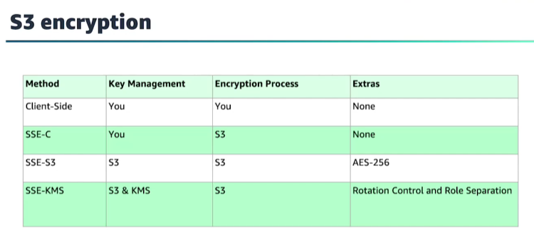
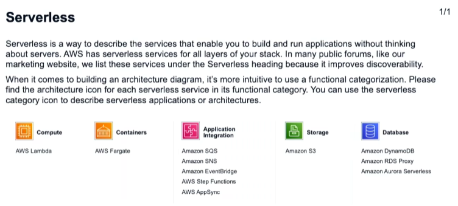

**Global resilient services**:
- IAM
- Route 53
- CloudFront
- AWS Edge locations
- WAF
- STS

**Regional services**:
- VPC 172.31.0.0/16 VPC default CIDR
- S3
- CloudTrail 
- Key Managment Service (KMS)
- Internet gateway attached to a VPC
- Data that **snapshots** store
- AMI 
- AWS Certificate Manager (ACM)
- AWS Config
- Internet Gateway

- Amazon EFS
- AWS Batch

**Availability Zone resilient**:
- EC2
- EBS Volumes

- Snapshots
- CloudHSM 

**Public services**:
- CloudWatch
- CloudWatch Logs
- Key Managment Service (KMS) 

**Private services**:
- S3
- EFS
- Amazon MQ

- **HTTP** runs on TCP port 80, **HTTPS** runs on TCP port 443

- **SSH** port-> 22

- **RDP** port -> 3389 over TCP

- With **active-passive systems**, you need **vertical scaling**. This means increasing the size of the server.

- **active-active system**: horizontal scaling

- **Vertical scaling** is a larger size and **horizontal scaling** is adding more instances of the same size, and adding elasticity is using automation along with horizontal scaling to match our capacity to our demand.

- **AWS WAF** can be deployed with: Application Load Balancer, Amazon API Gateway and CloudFront

- **ECS** -> Docker,  **EKS** -> Kubernetes

- **firewall** must be created at the VPC level and not at the subnet level